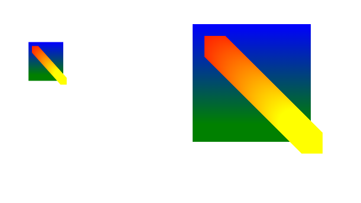
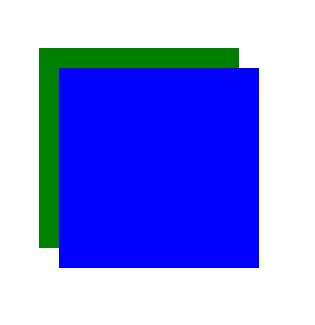

# Canvas

Canvas Api 提供了一个通过 Js 和 Html 的 `<canvas>` 元素来绘制图形的方式，用于动画、游戏画面、数据可视化、图片编辑以及实时视频处理等方面

<br>

## 示例入门

定义一个 200 * 200 的 canvas 元素，当没有设置宽度和高度的时候，canvas 会初始化宽度为 300 像素和高度为 150 像素

该元素可以使用 CSS 来定义大小，但在绘制时图像会伸缩以适应它的框架尺寸：如果 CSS 的尺寸与初始画布的比例不一致，它会出现扭曲

```html
<canvas id="canvas" height="200" width="200"></canvas>
```

> **注意:** 如果你绘制出来的图像是扭曲的, 尝试用 width 和 height 属性为 `<canvas>` 明确规定宽高，而不是使用 CSS。

```html
<script>
    const canvas = document.getElementById('canvas');
    const ctx = canvas.getContext('2d');
    ctx.fillStyle = 'green';
    ctx.fillRect(0, 0, 200, 200);// (x, y, width, height)
</script>
```

`<canvas>` 元素有一个叫做 `getContext()` 方法，这个方法是用来获得渲染上下文和它的绘画功能。`getContext()` 接受一个参数，即上下文的类型，可选值有：`2d|webgl|webgl2|bitmaprenderer` ，目前只关注 2d

这样就渲染出了一个绿色的正方形，fillStyle 指定了颜色，fillReact() 指定了画布初始渲染位置 (0, 0)，画布大小 200 * 200


canvas，主要通过填充（fill），和 画线框（stroke）两种方式来绘制图形

<br>

## Canvas Api

### 绘制矩形

#### fillStyle

给图形**填充**颜色

```js
ctx.fillStyle = "#ff0";
ctx.fillStyle = "yellow";
ctx.fillStyle = "rgb(200,0,0)";
ctx.fillStyle = "rgba(0, 0, 200, 0.5)";
```

<br>

#### fillRect

绘制一个**填充**矩形，fillRect(x, y, width, height)

```js
ctx.fillRect(0, 0, 200, 200)
```

<br>

#### strokeStyle

给**边框**设置颜色，用法同 fillStyle

```js
ctx.strokeStyle = "blue";
ctx.strokeStyle = "#ff0";
```

<br>

#### strokeRect

绘制一个矩形的**边框**，strokeRect(x, y, width, height)

```js
ctx.strokeStyle = "blue";
ctx.strokeRect(0, 0, 200, 200)
```

<br>

#### clearRect

清除指定矩形区域，让清除部分完全透明

```js
ctx.clearRect(45, 45, 60, 60);
```

<br>

### 绘制路径

图形的基本元素是路径。路径是通过不同**颜色**和**宽度**的线段或曲线相连形成的不同形状的点的集合。一个路径，甚至一个子路径，都是闭合的。使用路径绘制图形需要一些额外的步骤：

1. 首先，创建路径的起始点（beginPath，moveTo）
2. 使用画图命令去画路径（lineTo，arc，quadraticCurveTo，bezierCurveTo）
3. 之后将路径封闭（closePath）
4. 一旦路径生成，就可以通过描边和填充路径区来渲染颜色（stroke，fill）

注意：路径是由很多子路径组成的，这些子路径都是在一个列表中，所有的子路径（线、弧形、等等）构成图形。而每次 beginPath 调用之后，列表清空重置，然后我们就可以重新绘制新的图形。

闭合路径 closePath()，不是必需的。这个方法会通过绘制一条从当前点到起始点的直线来闭合图形。如果图形是已经闭合了的，即当前点为开始点，该函数什么也不做

**当调用 fill() 函数时，所有没有闭合的形状都会自动闭合，所以你不需要调用 closePath() 函数。但是调用 stroke() 时不会自动闭合**

<br>

#### moveTo

称为**笔触**，moveTo(x, y) 一个非常有用的函数，而这个函数实际上并不能画出任何东西，当我们画完一个子路径时，需要重新定位下一个子路径的起点，用以绘制出一些不连续的路径

```js
ctx.moveTo(110, 75);
```

<br>

#### lineTo

lineTo(x, y)，绘制一条从当前位置到指定 x 以及 y 位置的直线。开始点和之前的绘制路径有关，之前路径的结束点就是接下来的开始点，开始点也可以通过 `moveTo()` 函数改变

```js
ctx.lineTo(25, 105);
```

<br>

#### arc

arc(x, y, radius, startAngle, endAngle, anticlockwise)

画一个以（x, y）为圆心的以 radius 为半径的圆弧（圆），从 startAngle 开始到 endAngle 结束，按照 anticlockwise 给定的方向（默认为顺时针）来生成

> 注意：arc() 中的角度单位是**弧度**，不是角度，所以实际使用的时候，要用到这个计算公式：**弧度=(Math.PI/180)\*角度**

圆弧的起始点，类似于时钟上 3 点位置，例如，画一个下半圆弧

```js
ctx.beginPath()
ctx.strokeStyle = "red"
ctx.arc(150, 150, 20, 0, (Math.PI / 180) * 180 )
ctx.stroke()
```


anticlockwise 默认方向为顺时针，值为 false

一个逆时针方向的圆弧

```js
ctx.beginPath()
ctx.strokeStyle = "red"
ctx.arc(150, 150, 20, 0, (Math.PI / 180) * 180 , true)
ctx.stroke()
```


<br>

#### 贝塞尔曲线

有二次贝塞尔曲线和三次贝塞尔曲线，quadraticCurveTo，bezierCurveTo，二次及三次贝塞尔曲线都十分有用，一般用来绘制复杂有规律的图形。

注意，绘制贝塞尔曲线是在路径上的，一般上一个路径的结束点就是贝塞尔曲线的起点，你也可以使用**笔触**，moveTo 重新定位起点。

所以，我们使用贝塞尔曲线的时候，参数只需要关注**控制点**，以及**结束点**

二次贝塞尔曲线，quadraticCurveTo

```js
quadraticCurveTo(cp1x, cp1y, x, y)
```

绘制二次贝塞尔曲线，`cp1x, cp1y` 为一个控制点，`x, y` 结束点

<br>

三次贝塞尔曲线，bezierCurveTo

```js
bezierCurveTo(cp1x, cp1y, cp2x, cp2y, x, y)
```

绘制三次贝塞尔曲线，`cp1x, cp1y` 为控制点一，`cp2x, cp2y` 为控制点二，`x, y` 为结束点

二次与三次区别，可参考下 MDN 上的图，其中<font color="blue">蓝色点为起始点 & 结束点 </font>，<font color="red">红色点为控制点</font>


quadraticCurveTo


bezierCurveTo


<br>

示例：

```js

```

<br>

#### rect

路径上的矩形，rect()，将一个矩形路径增加到当前路径上

```js
rect(x, y, width, height)
```

当该方法执行的时候，moveTo()方法自动设置坐标参数（0,0）。也就是说，当前笔触自动重置回默认坐标。

<br>

### Path2D

我们可以使用一系列的画图指令绘制路径最终形成图形，为了简化代码，可以将这些路径全部存入一个对象中，更方便的调用

例如：

```js
function draw() {
    var canvas = document.getElementById('canvas');
    if (canvas.getContext) {
        var ctx = canvas.getContext('2d');

        var rectangle = new Path2D();
        rectangle.rect(10, 10, 50, 50);

        var circle = new Path2D();
        circle.moveTo(125, 35);
        circle.arc(100, 35, 25, 0, 2 * Math.PI);

        ctx.stroke(rectangle);
        ctx.fill(circle);
    }
}
```

构造函数

```js
new Path2D();     // 空的Path对象
new Path2D(path); // 克隆Path对象
new Path2D(d);    // 从SVG建立Path对象
```

前面介绍的所有路径方法，都可以在 path2D 中使用

Path2D API 添加了 `addPath` 作为将 `path` 结合起来的方法。当你想要从几个元素中来创建对象时，这将会很实用。比如：

```js
Path2D.addPath(path, [transform])
```

新的 Path2D API 有另一个强大的特点，就是使用 SVG path data 来初始化 canvas 上的路径。这将使你获取路径时可以以 SVG 或 canvas 的方式来重用它们

这条路径将先移动到点 `(M10 10)` 然后再水平移动80个单位 `(h 80)`，然后下移80个单位 `(v 80)`，接着左移80个单位 `(h -80)`，再回到起点处 (`z`)。

```js
var p = new Path2D("M10 10 h 80 v 80 h -80 Z");
```

<br>

### 样式和颜色

色彩和透明度主要通过 strokeStyle 和 fillStyle 来设置，前已提及

#### **透明度**

全局透明度

```js
ctx.globalAlpha = 0.2
```

不过，使用 strokeStyle fillStyle 的 rgba() 第四个参数足以

<br>


#### **线型**

lineWidth

设置线条宽度，属性值必须为正数。默认值是1.0

```js
ctx.lineWidth = 2
```


lineCap

设置线条末端样式，可选值：butt，round，square，如图所示

```js
ctx.lineCap = 'butt'
```


lineJoin

设定线条与线条间接合处的样式，可选值：round，bevel，miter。最上面一条是 round 的效果，边角处被磨圆了，圆的半径等于线宽。中间和最下面一条分别是 bevel 和 miter 的效果。当值是 miter  的时候，线段会在连接处外侧延伸直至交于一点

```js
ctx.lineJoin = 'round'
```


miterLimit

限制当两条线相交时交接处最大长度；所谓交接处长度（斜接长度）是指线条交接处内角顶点到外角顶点的长度

getLineDash

返回一个包含当前虚线样式，长度为非负偶数的数组

setLineDash

设置当前虚线样式

lineDashOffset

设置虚线样式的起始偏移量

<br>

#### 渐变

渐变主要有两种，线性渐变和径向渐变

createLinearGradient 和 createRadialGradient

使用的时候，我们主要创建出这两种渐变的对象，并通过 addColorStop 为它设置颜色变化，最后将这个对象赋值给 2D 渲染上下文的 strokeStyle 或者 fillStyle

```js
const canvas = document.getElementById("canvas")
const ctx = canvas.getContext('2d')

// createLinearGradient 方法接受 4 个参数，表示渐变的起点 (x1,y1) 与终点 (x2,y2)。
const linear = ctx.createLinearGradient(30, 30, 30, 200)
// 第一个参数指定渐变颜色所处的位置 0-1，
linear.addColorStop(0, "blue")
linear.addColorStop(1, "green")


// 方法接受 6 个参数，前三个定义一个以 (x1,y1) 为原点，半径为 r1 的圆，
// 后三个参数则定义另一个以 (x2,y2) 为原点，半径为 r2 的圆。
const radial = ctx.createRadialGradient(50, 50, 25, 200, 200, 25)
radial.addColorStop(0, "red")
radial.addColorStop(1, "yellow")

ctx.fillStyle = linear
ctx.fillRect(30, 30, 200, 200)

ctx.fillStyle = radial
ctx.fillRect(50, 50, 200, 200)

```


<br>

#### 阴影

shadowOffsetX = float，设置阴影在 x 方向的延伸距离

shadowOffsetY= float，设置阴影在 y 方向的延伸距离

shadowBlur = float，设置阴影模糊度

shadowColor，设置阴影颜色，默认全透明的黑色

```js
ctx.shadowOffsetX = 5
ctx.shadowOffsetY = 5
ctx.shadowBlur = 5
ctx.shadowColor = "rgba(0, 0, 0, 0.5)"
ctx.fillStyle = "pink"
ctx.fillRect(50, 50, 200, 200)
```


<br>


### 绘制文本

canvas 提供了两种方式来绘制文本：

在指定的 (x, y) 位置填充指定的文本，绘制的最大宽度是可选的

```js
fillText(text, x, y, [, maxWidth])
```

在指定的 (x, y) 位置绘制文本边框，绘制的最大宽度是可选的

```js
strokeText(text, x, y, [, maxWidth])
```

例子：

```js
ctx.font = "30px serif";
ctx.fillText("hello canvas", 50, 50)
ctx.strokeText("hello canvas", 50, 50)
```


文本可以像 css3 那样设置样式，如

```js
// start, end, left, right or center. 默认值是 start
ctx.textAilgn = "center"

// 文本方向，可能的值包括：ltr, rtl, inherit。默认值是 inherit。
ctx.direction = "ltr"

// 基线对齐选项，可选的值包括：top, hanging, middle, alphabetic, ideographic, bottom。默认值是 alphabetic
ctx.textBaseline = "alphabetic"

// 文字大小和字体
ctx.font = "16px serif"
```

<br>

### 使用图片

在 canvas 中使用图片，用到 drawImage 这个方法，它有三个重载

drawImage(image, x, y)

drawImage(image, x, y, width, height)

drawImage(image, sx, sy, sWidth, sHeight, dx, dy, dWidth, dHeight)

其中，image 是 HTMLImageElement、HTMLCanvasElement 和 HTMLVideoElement 中的任一个对象

示例，

```html
<body>
    <canvas id="canvas" width="300" height="300"></canvas>
    
    <script>
        const canvas = document.getElementById("canvas")
        const ctx = canvas.getContext("2d")
        const img = document.getElementById("img")
        img.onload = function () {
            ctx.drawImage(img, 50, 50)
        }
    </script>
</body>
```

**注意：必须等到图片加载完毕之后才能在画布中绘制图像**

它的第二个重载多了两个参数 width 和 height，指的是图片将在画布中的图像尺寸，左侧为 canvas 元素，右侧为 img 元素

```js
img.onload = function () {
    ctx.drawImage(img, 50, 50, 100, 100)
}
```



第三次重载，是用来做裁剪图片，或者说切片，截取图片上某块区域到 canvas 画布中，它的参数可借助 MDN 上的图来理解


例子，截取左上角

```js
img.onload = function () {
    ctx.drawImage(img, 10, 10, 100, 100, 50, 50, 100, 100)
}
```


<br>

### 变形

了解变形之前，介绍两个在开始绘制复杂图形时必不可少的方法

`save`

可以保存画布的所有状态

`restore`

可以恢复画布状态

画布的状态是以栈的存储的，它的状态包括：

* 当前应用的变形（即移动，旋转和缩放）
* [`strokeStyle`](https://developer.mozilla.org/zh-CN/docs/Web/API/CanvasRenderingContext2D/strokeStyle), [`fillStyle`](https://developer.mozilla.org/zh-CN/docs/Web/API/CanvasRenderingContext2D/fillStyle), [`globalAlpha`](https://developer.mozilla.org/zh-CN/docs/Web/API/CanvasRenderingContext2D/globalAlpha), [`lineWidth`](https://developer.mozilla.org/zh-CN/docs/Web/API/CanvasRenderingContext2D/lineWidth), [`lineCap`](https://developer.mozilla.org/zh-CN/docs/Web/API/CanvasRenderingContext2D/lineCap), [`lineJoin`](https://developer.mozilla.org/zh-CN/docs/Web/API/CanvasRenderingContext2D/lineJoin), [`miterLimit`](https://developer.mozilla.org/zh-CN/docs/Web/API/CanvasRenderingContext2D/miterLimit), [`lineDashOffset`](https://developer.mozilla.org/zh-CN/docs/Web/API/CanvasRenderingContext2D/lineDashOffset), [`shadowOffsetX`](https://developer.mozilla.org/zh-CN/docs/Web/API/CanvasRenderingContext2D/shadowOffsetX), [`shadowOffsetY`](https://developer.mozilla.org/zh-CN/docs/Web/API/CanvasRenderingContext2D/shadowOffsetY), [`shadowBlur`](https://developer.mozilla.org/zh-CN/docs/Web/API/CanvasRenderingContext2D/shadowBlur), [`shadowColor`](https://developer.mozilla.org/zh-CN/docs/Web/API/CanvasRenderingContext2D/shadowColor), [`globalCompositeOperation`](https://developer.mozilla.org/zh-CN/docs/Web/API/CanvasRenderingContext2D/globalCompositeOperation), [`font`](https://developer.mozilla.org/zh-CN/docs/Web/API/CanvasRenderingContext2D/font), [`textAlign`](https://developer.mozilla.org/zh-CN/docs/Web/API/CanvasRenderingContext2D/textAlign), [`textBaseline`](https://developer.mozilla.org/zh-CN/docs/Web/API/CanvasRenderingContext2D/textBaseline), [`direction`](https://developer.mozilla.org/zh-CN/docs/Web/API/CanvasRenderingContext2D/direction), [`imageSmoothingEnabled`](https://developer.mozilla.org/zh-CN/docs/Web/API/CanvasRenderingContext2D/imageSmoothingEnabled)
* 当前的裁剪路径

一个简单的例子，

```js
ctx.fillStyle = "blue"
ctx.save()

ctx.fillStyle = "green"
ctx.save()

ctx.restore()
ctx.fillRect(50, 50, 200, 200)

ctx.restore()
ctx.fillRect(70, 70, 200, 200)
```



首先保存填充颜色<font color=blue>蓝色</font>，再保存填充颜色<font color=green>绿色</font>，由于栈是先进后出的，所以第一个矩形是绿色的，第二个是蓝色的

对于绘制复杂的图形，这两个操作可以显著的减少不必要的代码

<br>

#### translate

用来移动 canvas 的原点到一个不同的位置

```js
ctx.translate(50, 50)
```

<br>

#### rotate

用于以原点为中心旋转 canvas，这个方法只接受一个参数：旋转的角度(angle)，它是顺时针方向的，以弧度为单位的值

意味着要顺时针旋转 90 度的话

```js
ctx.rotate((Math.PI / 180) * 90)
```

<br>

#### scale

缩放，可以缩放画布的水平和垂直的单位。两个参数都是实数，可以为负数，x 为水平缩放因子，y 为垂直缩放因子，如果比 1 小，会缩小图形， 如果比 1 大会放大图形。默认值为 1， 为实际大小

```js
ctx.scale(10, 3)
```

<br>

#### transform

