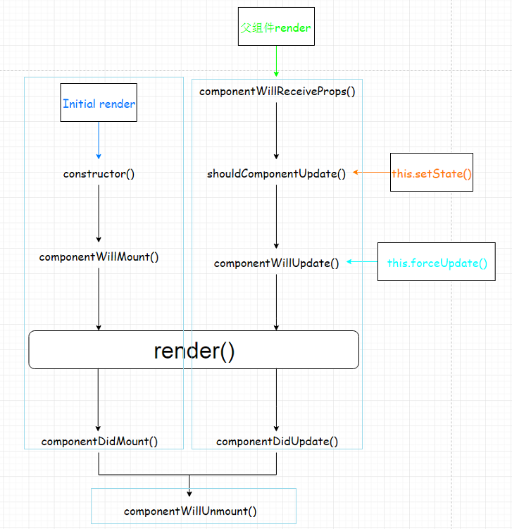
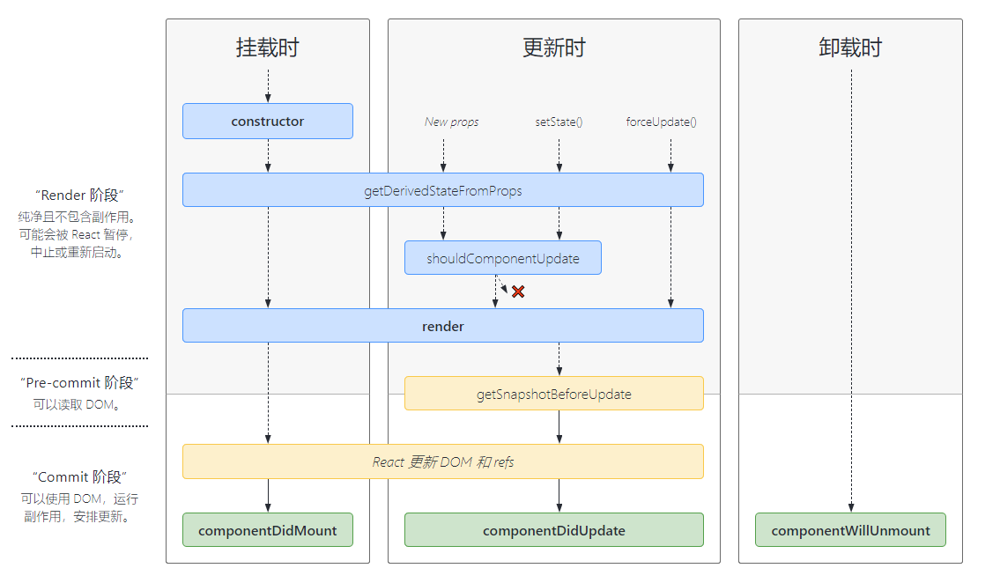

# React

用于构建用户界面的 JavaScript 库。

**声明式**

React 使创建交互式 UI 变得轻而易举。为你应用的每一个状态设计简洁的视图，当数据改变时 React 能有效地更新并正确地渲染组件。

以声明式编写 UI，可以让你的代码更加可靠，且方便调试。

**组件化**

创建拥有各自状态的组件，再由这些组件构成更加复杂的 UI。

组件逻辑使用 JavaScript 编写而非模版，因此你可以轻松地在应用中传递数据，并使得状态与 DOM 分离。

**一次学习，随处编写**

无论你现在正在使用什么技术栈，你都可以随时引入 React 来开发新特性，而不需要重写现有代码。

React 还可以使用 Node 进行服务器渲染，或使用 [React Native](https://reactnative.dev/) 开发原生移动应用。

**高效**

使用虚拟（virtual）DOM，不总是直接操作 DOM。DOM Diff 算法，最小化页面重绘。

<br>

## Hello React

首先 `<script>` 引入相关库 react.js、react-dom.js、babel.min.js，顺序不能改变

```html
<script type="text/javascript" src="../js/react.development.js"></script>
<script type="text/javascript" src="../js/react-dom.development.js"></script>
<script type="text/javascript" src="../js/babel.min.js"></script>
```

编写代码

```html
<div id = 'root'></div>

<script type="text/bable">// 必须声明 babel
// 创建虚拟 DOM 元素
const vDom = <h1>Hello React</h1> // 千万不要加引号
// 渲染虚拟 DOM 到页面真实 DOM 容器中
ReactDOM.render(vDom, document.getElementById('root'))
</script>
```

一个 Hello React 在页面上呈现了！

想要将一个 React 元素渲染到根 DOM 节点中，只需把它们一起传入 [`ReactDOM.render()`](https://react.docschina.org/docs/react-dom.html#render)

<br>

## JSX

```react
const element = <h1>Hello, world!</h1>;
```

这个有趣的标签语法既不是字符串也不是 HTML。

它被称为 JSX，是一个 JavaScript 的语法扩展。我们建议在 React 中配合使用 JSX，JSX 可以很好地描述 UI 应该呈现出它应有交互的本质形式。

React 认为渲染逻辑本质上与其他 UI 逻辑内在耦合，比如，在 UI 中需要绑定处理事件、在某些时刻状态发生变化时需要通知到 UI，以及需要在 UI 中展示准备好的数据。

React 不强制要求使用 JSX，但是大多数人发现，在 JavaScript 代码中将 JSX 和 UI 放在一起时，会在视觉上有辅助作用。它还可以使 React 显示更多有用的错误和警告消息。

<br>

**在 JSX 中嵌入表达式**

在 JSX 语法中，你可以在大括号内放置任何有效的 JavaScript 表达式。

```react
const name = 'React';

const element = <h1>Hello, {name}</h1>;

ReactDOM.render(
  element,
  document.getElementById('root')
);
```

<br>

**JSX 特定属性**

你可以通过使用引号，来将属性值指定为字符串字面量

```react
const element = <div tabIndex="0"></div>;
```

也可以使用大括号，来在属性值中插入一个 JavaScript 表达式：

```react
const element = </img>;
```

在属性中嵌入 JavaScript 表达式时，不要在大括号外面加上引号。你应该仅使用引号（对于字符串值）或大括号（对于表达式）中的一个，对于同一属性不能同时使用这两种符号。

> 注意：在 JSX 中，标签的属性要变为小驼峰命名法，类名属性变为 className

ES9 对象扩展运算符「...」在 JSX 的应用，看下述代码

```react
let obj = {
    className: 'x',
    age: 18
}

const element = <div {...obj}></div>;
// --> const element = <div className = 'x' age = {18}></div>
```

这是因为在 babel 和 react 的作用下，对象在 JSX 的扩展运算符才不会出错，一般情况下直接 `...obj` 是会报错的，它常用来浅拷贝对象

```javascript
const skillOne = { q: '天音波' }
const skillTwo = { w: '金钟罩' }
const mangseng = {
	...skillOne,
	...skillTwo,
	...skillThree,
	...skillFour
};
```

<br>

**使用 JSX 指定子元素**

JSX 中不能有多个根标签，假如一个标签里面没有内容，你可以使用 `/>` 来闭合标签，就像 XML 语法一样：

```react
const element = ;
```

JSX 标签里能够包含很多子元素：

```react
const element = (
  <div>
    <h1>Hello!</h1>
    <h2>Good to see you here.</h2>
  </div>
);
```

<br>

**JSX 语法规则小结**

1. 定义虚拟 DOM 时，不要写引号
2. 标签中混入 JS 表达式时要用花括号 {}
3. 样式的类名指定不要 class，要用 className
4. 内联样式，要用 style = {{key: value}} 的形式去写
5. 只有一个根标签，标签必须闭合
6. 标签首字母
   * 若小写字母开头，则将转换 html 标签中同名标签，若 html 中无该标签对应的同名元素，报错
   * 若大写字母开头，react 渲染对应的组件，若组件没有定义，报错

<br>

## 组件

组件允许你将 UI 拆分为独立可复用的代码片段，并对每个片段进行独立构思

理解：用来实现特定功能效果的代码集合（html / css / js）

为什么: 一个界面的功能太复杂了

作用: 复用编码, 简化项目界面编码, 提高运行效率

**函数组件**

定义组件最简单的方式就是编写 JavaScript 函数：

```react
function Welcome(props) {
  return <h1>Hello, {props.name}</h1>;
}
```

该函数是一个有效的 React 组件，因为它接收唯一带有数据的 “props”（代表属性）对象与并返回一个 React 元素

同时还可以使用 ES6 的 class 来定义组件

**class 组件**

必须继承 React.Component

```react
class Welcome extends React.Component {
  render() {
    return <h1>Hello, {this.props.name}</h1>;
  }
}
```

上述两个组件在 React 里是等效的。

<br>

**组合组件**

例如，我们可以创建一个可以多次渲染 `Welcome` 组件的 `App` 组件：

```react
function App() {
  return (
    <div>
      <Welcome name="Sara" />
      <Welcome name="Cahal" />
      <Welcome name="Edite" />
    </div>
  );
}
ReactDOM.render(
  <App />,
  document.getElementById('root')
);
```

<br>

## state

到现在为止，我们的组件都是静态的，如何更新组件呢

在 react 中，主要通过 state 属性来维护组件自身的状态，使用了 state 的组件称为有状态组件

以类组件为例，通过点击 h1 标签改变首字母大写

```react
class Welcome extends React.Component {
    constructor(props){
        super(props)
     	this.state = {
        	name : 'react',
      	}
    }
    
    change = () => {
        this.setState({
            name: 'React'
        })
    }
    
    render() {
        const { name } = this.state;
    	return (
          <div>
            <h1 onClick = {this.change}>Hello, {name}</h1>
          </div>
    	);
  	}
}
```

* state 是组件对象最重要的属性, 值是对象（可以包含多个数据）
* 组件被称为"状态机", 通过更新组件的 state 来更新对应的页面显示（重新渲染组件）

<br>

**react 中 this 指向**

在 class 组件中，定义的方法都是放在 class 原型对象上面的，供通过 ReactDOM 调用产生 class 实例对象使用。当绑定的时候，方法往往作为**回调**绑定到 DOM 元素，所以不是通过实例调用的，而是直接调用。且，class 中的方法默认开启了局部严格模式，所以 this 指向了 undefined

可以通过 bind 改变函数内部 this 指向，同时返回一个新的函数，将它挂载到实例对象身上

```javascript
class Person{
    constructor(props){
       super(props)
       this.run = this.run.bind(this);
    }
    
    run(){
        // ...
    }
}
```

为什么赋值语句 + 箭头函数拥有同样的效果

```javascript
run = () => {}
```

因为箭头函数的特性是：this 是静态的，**始终指向函数声明时所在作用域下的 this 值**，也就是实例化对象。而且该函数是定义在实例化对象身上的，不在 class 的原型对象，相当于

```javascript
this.run = () => {}
```

类中可以直接写赋值语句，给实例对象添加属性

<br>

**强烈注意**

1. 组件内置的方法中的 this 为组件对象
2. 在组件类中自定义的方法中 this 为 null
   * 强制绑定 this：通过函数对象的 bind()
   * 箭头函数（ES6 模块化编码时才能使用）

<br>

**如何正确使用 state**

1. 不要直接修改 state，而应该使用 `setState()`，且不要在构造函数中使用 `setState()`

```react
this.state.name = 'React'; // x

this.setState({
    name: 'React'
})
```

2. state 更新会被合并

```react
this.setState({ name: 'React'})
this.setState({ name2: 'Vue'})
///---> this.setState({ name: 'React', name1: 'Vue' })
```

3. state 更新可能是异步的，出于性能考虑，React 可能会把多个 `setState()` 调用合并成一个调用。

<br>

## props

每个组件对象都会有 props（properties 的简写）属性

组件标签的所有属性都保存在 props 中，例如下面 Welcome 组件

```react
<Welcome name = 'react' age = {18} fn = {()=>{}}></Welcome>
```

该标签上写的属性，都会以对象 key: value 的形式收集到 props 中

```react
console.log(props);
// {name: 'react', age: 18}
```

> 组件无论是使用函数声明还是通过 class 声明，都不能修改自身的 props，因为它是**只读**的

<br>

**props 的使用**

```react
function Welcome(props){
    const { name, age } = this.props;
    return (
        <div>
			<h1>{name}</h1>
            <h1>{age}</h1>
        </div>
    );
}

class Welcome extends React.Component {
    render() {
        const { name, age } = this.props;
    	return (
          <div>
            <h1>{name}</h1>
            <h1>{age}</h1>
          </div>
    	);
  	}
}
```

<br>

**对 props 进行限制**

引入 PropsType

```react
import PropsType from 'props-type';

class Welcome extends React.Component {
    render() {
        const { name, age } = this.props;
    	return (
          <div>
            <h1>{name}</h1>
            <h1>{age}</h1>
          </div>
    	);
  	}
}

// 限制类型
Welcome.propsType = {
    name: PropsType.string.isRequired, // name 属性必须传一个字符串
    age: PropsType.number,
    fn: PropsType.func
}

// props 默认值
Welcome.defaultProps = {
    name: 'react',
    age: 18
}
```

特别地，对于 class 组件，可以将这些限制放在类里面

```react
class Welcome extends React.Component {
    static propsType = {
        name: PropsType.string.isRequired, // name 属性必须传一个字符串
    	age: PropsType.number,
    	fn: PropsType.func
    }

	static defaultProps = {
        name: 'react',
    	age: 18
    }
	// ...
}
```

<br>

**构造函数中的 props**

通常构造函数仅仅使用以下两种情况

* 通过 this.state 初始化内部 state
* 为事件处理函数绑定实例

如果没有以上两种情况，则不需要为组件添加构造函数

在 React 组件挂载之前，会调用它的构造函数。在为 React.Component 子类实现构造函数时，应在其他语句之前调用 `super(props)`。否则，`this.props` 在构造函数中可能会出现未定义的 bug

<br>

## refs 与事件处理

### ref

组件内的标签都可以定义 ref 属性来标识自己，通常与事件处理一起使用

例如，点击 h1 标签，获取标签内容并打印

```react
class Welcome extends React.Component {
    showH1 = () => {
		console.log(this.refs.h1);
    }
    
    render() {
        const { name } = this.state;
    	return (
          <div>
            <h1 ref = "h1" onClick = {this.showH1}>Hello, React</h1>
          </div>
    	);
  	}
}
```

通过 ref 标识的 DOM 元素，它将会被收集到 React 组件实例对象的 refs 的属性上

这种字符串形式已经废弃了，可能会有效率问题

<br>

**回调形式 ref（推荐使用）**

React 也支持另一种设置 refs 的方式，称为“回调 refs”。它能助你更精细地控制何时 refs 被设置和解除

```react
class Welcome extends React.Component {
    showInput = () => {
        const { input1 } = this;
		console.log(input1);
    }
    
    render() {
        const { name } = this.state;
    	return (
          <div>
            <input ref = {currentNode => this.input1 = currentNode} onClick = {this.showInput}/>
          </div>
    	);
  	}
}
```

这种形式将 DOM 挂到到组件实例自身了

> 如果 `ref` 回调函数是以内联函数的方式定义的，在更新过程中它会被执行两次，第一次传入参数 `null`，然后第二次会传入参数 DOM 元素。这是因为在每次渲染时会创建一个新的函数实例，所以 React 清空旧的 ref 并且设置新的。通过将 ref 的回调函数定义成 class 的绑定函数的方式可以避免上述问题，但是大多数情况下它是无关紧要的。

<br>

**React.createRef()**

这种方式是官方推荐的做法，React.createRef() 调用后可以返回**一个**容器，该容器

可以存储被 ref 所标识的节点

```react
class Welcome extends React.Component {
    
    myRef = React.createRef();
    
	// 注意：myRef 是一个对象，DOM 元素实际在 myRef.current 中
	// current 属性名是固定的
    showInput = () => {
        const { myRef } = this;
		console.log(myRef.current.value);
    }
    
    render() {
        const { name } = this.state;
    	return (
          <div>
            <input ref = {this.myRef} onClick = {this.showInput}/>
          </div>
    	);
  	}
}
```

该容器是专人专用的，要使用其他的节点，请用  React.createRef() 定义多个 ref，挂载到组件实例

不要过度使用 ref

<br>

### 事件处理

React 元素的事件处理和 DOM 元素的很相似，但是有一点语法上的不同：

* React 事件的命名采用小驼峰式（camelCase），而不是纯小写
* 使用 JSX 语法时你需要传入一个函数作为事件处理函数，而不是一个字符串

```react
function Form() {
	function handleSubmit(e) {
        // React 中你不能通过返回 false 的方式阻止默认行为。你必须显式的使用 preventDefault
    	e.preventDefault();
    	console.log('You clicked submit.');
  	}

  	return (
    	<form onSubmit={handleSubmit}>
      		<button type="submit">Submit</button>
    	</form>
  	);
}
```

通过 onXxx 属性指定的事件处理函数

* React 使用的是自定义合成事件，而不是 DOM 原生事件
* React 中的事件是通过委托方式处理（委托给组件最外层）
* 通过 event.target 得到发生事件的 DOM 元素对象

<br>

## 受控 / 非受控组件

在 HTML 中，表单元素（如`<input>`、 `<textarea>` 和 `<select>`）通常自己维护 state，并根据用户输入进行更新。而在 React 中，可变状态（mutable state）通常保存在组件的 state 属性中，并且只能通过使用 `setState()` 来更新。

我们可以把两者结合起来，使 React 的 state 成为“唯一数据源”。渲染表单的 React 组件还控制着用户输入过程中表单发生的操作。被 React 以这种方式控制取值的表单输入元素就叫做“受控组件”。

例如

```react
class Login extends React.Component{
    
    state = {
        username: '',
        password: ''
    }
    
    handleSubmit = e => {
        e.preventDefault();
        const {username, password} = this.state;
    	console.log(username + '-' +password)
    }
    
    saveUsername = e => {
        this.setState({
            username: e.target.value
        })
    }
    
    savePassword = e => {
        this.setState({
            password: e.target.value
        })
    }
    
    render(){
        return (
        	<form onSubmit={this.handleSubmit}>
            	用户名：<input onChange={this.saveUsername} type='text' name='username'/><br></br>
                密码：<input onChange={this.savePassword} type='password' name='password'/>
                <button>登录</button>
            </form>
        )
    }
}
```

组件不是这种通过 state 完全控制的就是”非受控组件“

<br>

## 生命周期

组件的三个生命周期状态

1. Mount（挂载）：插入真实 DOM
2. Update（更新）：`setState()` 被重新渲染
3. Umount（卸载）：移除真实 DOM

React 为每个状态提供了钩子函数（旧），加粗为重要常用钩子

* componentWillMount()
* **render()**
* **componentDidMount()**
* shouldComponentUpdate()
* componentWillReceiveProps()
* componentWillUpdate()
* componentDidUpdate()
* **componentWillUnmount()**

<br>



生命周期流程

挂载卸载过程

1. constructor()
2. componentWillMount()
3. componentDidMount()
4. componentWillUnmount()

更新过程

1. componentWillReceiveProps(nextProps)
2. shouldComponentUpdate() ---------------------------> 返回 boolean 是否允许更新
3. componentWillUpdate(nextProps, nextState)
4. componentDidUpdate(preProps, preState)
5. render()

其中有三个钩子函数要被废弃要加 `UNSAFE_` 前缀，以避免在未来版本中出错

* [`UNSAFE_componentWillMount()`](https://zh-hans.reactjs.org/docs/react-component.html#unsafe_componentwillmount)
* [`UNSAFE_componentWillUpdate()`](https://zh-hans.reactjs.org/docs/react-component.html#unsafe_componentwillupdate)
* [`UNSAFE_componentWillReceiveProps()`](https://zh-hans.reactjs.org/docs/react-component.html#unsafe_componentwillreceiveprops)

<br>

新版生命周期



主要的变化

废弃上述三个过时钩子，引入两个新的钩子函数

* [`static getDerivedStateFromProps(props, state)`](https://zh-hans.reactjs.org/docs/react-component.html#static-getderivedstatefromprops)

  `getDerivedStateFromProps` 会在调用 render 方法之前调用，并且在初始挂载及后续更新时都会被调用。它应返回一个对象来更新 state，如果返回 `null` 则不更新任何内容

* [`getSnapshotBeforeUpdate(prevProps, prevState)`](https://zh-hans.reactjs.org/docs/react-component.html#getsnapshotbeforeupdate)

  `getSnapshotBeforeUpdate()` 在最近一次渲染输出（提交到 DOM 节点）之前调用。它使得组件能在发生更改之前从 DOM 中捕获一些信息（例如，滚动位置）。此生命周期方法的任何返回值将作为参数传递给 `componentDidUpdate()`。

<br>

## diffing 算法

为什么遍历列表时，key 最好不要用 index ？

简单的说，key 是虚拟 DOM 对象的标识，在更新显示时 key 起着极其重要的作用。

详细的说，当状态中的数据发生变化时，react 会根据【数据】生成【新的虚拟 DOM】，随后 react 进行【新虚拟 DOM】与【旧虚拟 DOM】的 diff 比较，比较规则如下：

a. 旧虚拟 DOM 中找到了与新虚拟 DOM 相同的 key

* 若虚拟 DOM 中内容没变，直接使用之前的真实 DOM
* 若虚拟 DOM 中内容变了，则生成新的真实 DOM，随后替换页面之前的真实 DOM

b. 旧虚拟 DOM 中未找到与新虚拟 DOM 相同的 key

* 根据数据创建新的真实 DOM，随后渲染到页面

用 index 作为 key 会引发的问题：

1. 若对数据进行：逆序添加、逆序删除等破坏顺序的操作

   会产生没有必要的真实 DOM 更新 ==> 界面效果没问题，但效率低

2. 如果结构中还包含输入类的 DOM

   会产生错误的 DOM 更新 ==> 界面内容错位有问题

3. 注意！如果不存在对数据的逆序添加、逆序删除等破坏顺序操作，仅用于渲染列表展示，使用 index 作为 key 是没有问题的

开发如何选择 key

* 最好使用每条数据的唯一标识最为 key，比如 id、身份证号、学号等
* 如果确定只是简单的展示数据，用 index 也是可以的

<br>

## TodoList

相关知识点总结

1. 拆分组件、实现静态组件，注意：className、style 的写法
2. 动态初始化列表，如何确定将数据放在哪个组件的 state 中
   * 某个组件使用，放在其自身的 state 中
   * 某些组件使用，放在它们的共同父组件 state 中（状态提升）
3. 关于父子组件之间的通信
   * 【父组件】给【子组件】传递数据，通过 props 传递
   * 【子组件】给【父组件】传递数据，通过 props 传递，要求父组件给子组件传递一个函数
4. 注意 defaultChecked 和 checked 的区别，类似的还有 defaultValue 和 value，default 的只在初始化默认执行一次
5. 状态在哪里，操作状态的方法就在那里

## react 脚手架

### 脚手架配置代理

实际开发经常遇到跨域，需要配置代理

简单配置

在 package.json 最下追加配置

```json
"proxy": "http://localhost:5000/xxx"
```

说明：

1. 优点：配置简单，前端请求可以不加任何前缀
2. 缺点：不能配置多个代理
3. 工作方式：上述方式配置代理，当请求了 3000 端口（假设为本机启动端口）不存在的资源时，那么该请求就会转发到 5000

<br>

多端接口配置跨域

先删除 package.json 新配置的代理，在 src 下创建配置文件 src/setupProxy.js

```javascript
const proxy = require('http-proxy-middleware')

module.exports = function(app){
    app.use(
    	proxy('/api1', {// api1 是需要转发的请求（所有带api1前缀的请求都会转发给5000）
            target: 'http://localhost:5000',// 配置转发目标地址（能返回数据服务器地址）
            changeOrigin: true,// 控制服务器收到请求头中host字段的值
            /*
            	changeOrigin为true，服务器收到请求头中host为：localhost:5000
            	changeOrigin为true，服务器收到请求头中host为：localhost:3000
            	一般设置为true
            */
            pathRewrite: {'^/api1': ''}// 去除请求前缀，保证交给后台服务器是正确请求地址（必配置）
            
        }),
        proxy('/api2', {
            target: 'http://localhost:5001',
            changeOrigin: true,
            pathRewrite: {'^/api2': ''}
        })
    )
}
```

说明：

1. 优点：可以配置多个代理，可以灵活控制请求是否走代理
2. 缺点：配置繁琐，前端请求必须加前缀

<br>

## PubSubJS

它是一种组件之间传递数据的一种解决方案，采用发布订阅的模式，此插件可以用在中小项目上

使用十分简单

[PubSubJS github](https://github.com/mroderick/PubSubJS)

<br>

## fetch

fetch 使用 https://www.bilibili.com/video/BV1wy4y1D7JT?p=72&t=2711.0

fetch 返回的是一个 promise 对象，它设计思想是关注分离的，第一次访问地址询问是否访问成功，随后才调用 `response.json()` 返回数据，这也是个 promise 对象

```javascript
function async fn(){
    try{
        const response= await fetch(`/api1/search/users2?q=${keyWord}`)
        const data = await response.json()
        console.log(data);
    }catch (error){
        console.log('请求出错',error);
    }
}
```

<br>

## react 路由

此路由不同于后端路由，只用于展示页面组件

在 react 中使用 react-router-dom 来使用前端路由

原理是使用浏览器内置的 history 对象，通过该对象身上的 `listen` 方法，监听浏览器地址栏变化，从而动态改变展示的组件

以一个简例学习

### 快速入门

下载安装

```shell
## 安装 react 脚手架并创建项目
npm install -g create-react-app
create-react-app demo-app
cd demo-app

## 安装 react-router-dom
## or, if you're not using yarn
## yarn add react-router-dom 
npm install react-router-dom
```

进入项目修改App.js

```react
import React from 'react'
import {BrowserRouter as Router,Route,Link} from 'react-router-dom'

const Home = () => (<div><h2>Home</h2></div>)

const About = () => (<div><h2>About</h2> </div>)

const Topic = ({ match }) => (<div><h3>{match.params.topicId}</h3></div>)

const App = () => (
  <Router>
    <div>
      <ul>
        <li><Link to="/">Home</Link></li>
        <li><Link to="/about">About</Link></li>
        <li><Link to="/topics">Topics</Link></li>
      </ul>
      <hr/>
      <Route exact path="/" component={Home}/>
      <Route path="/about" component={About}/>
      <Route path="/topic" component={Topic}/>
    </div>
  </Router>
)
export default App
```

启动项目 `npm start`
浏览器输入：`http://localhost:3000/`
观察到以下页面表示使用 router 成功


<br>

**Link**

使用该组件可以编写路由路径 path，改变浏览器地址栏的路径，基本语法

```react
<Link to="/">Home</Link>
```

`to` 属性：链接位置的字符串表示，还可以是一个对象

```react
<Link to={{
  pathname: '/courses',						// pathname: 表示要链接到的路径的字符串。
  search: '?sort=name',						// search: 表示查询参数的字符串形式。
  hash: '#the-hash',						// 放入网址的 hash，例如 #a-hash。
  state: { fromDashboard: true }			// 给要展示的组件传递一些参数
}}/>
```

还有一个比较常用的属性 `replace`，如果为 true，则单击链接将替换历史堆栈中的当前入口，而不是添加新入口。
react-router-dom是基于浏览器的 history 对象来进行操作的，该对象使用栈数据结构维护历史记录，当点击一个新的链接时，就将该链接入栈，如果 replace 属性为true，点击时总是替换 history 对象的栈顶链接。
<br>

**Route**

使用该组件可以对上面 `Link` 编写好的路由路径进行注册，并设置路径对应要展示的组件。注册的路由在进行匹配时，是从上到下按顺序匹配的，若没有 `Switch` 包裹，无论有多少个 `Route` 都进行一遍扫描匹配。
文档原话：它最基本的职责是在 location 与 `Route` 的 path 匹配时呈现一些 UI。

```react
<Route exact path="/" component={Home}/>
```

常用属性：

* `exact`：如果为 true，则只有在路径完全匹配时才匹配。默认模糊匹配，即浏览器地址只有前面部分完美匹配时才显示，如浏览器为 /about/a/b/c，而Route为 /about，可以匹配成功，两者反之则不行。
* `path`：任何可以解析的有效的 URL 路径，一般对应 `Link` 的 `to` 属性
* `component`：只有当位置匹配时才会渲染的 React 组件。
* `render`：与 `component` 作用相同，该方式使用内联编写，而不引用外部暴露的 React 组件。render 的类型是 function，Route 会渲染这个 function 的返回值。因此它的作用就是附加一些额外的逻辑
* `sensitive`：如果路径区分大小写，则为 true ，则匹配。

<br>

**BrowserRouter**

包裹 Link 和 Route 的组件，使得 UI 组件与地址 URL 保持同步，若 Link 和 Route 不被 BrowserRouter 包裹，则会报错。另外，Link 编写的好的路径，在注册时，Link 和 Route 必须要在同一个 BrowserRouter 内才会起作用，不能分开在不同的 BrowserRouter。通常可直接在项目入口 index.js 中包含 `<App/>` 组件使用。

```react
<BrowserRouter basename={optionalString}>
  <App/>
</BrowserRouter>
```

* `basename`：所有地址的基本网址。如果您的应用程序是从服务器上的子目录提供的，则需要将其设置为子目录。格式正确的基本名应该有一个前导斜线，但是结尾不能有斜线。

```react
<BrowserRouter basename="/calendar"/>
<Link to="/today"/> // renders <a href="/calendar/today">
```

react-router-dom 还有一个组件与 `BrowserRouter` 有同样的作用，`HashRouter`。与之不同，`HashRouter`会在路径后面添加一个 `#` 号，如

```react
<HashRouter basename="/calendar"/>
<Link to="/today"/> // renders <a href="#/calendar/today">
```

它是利用 H5 点击锚点会产历史记录的原理，所以地址栏上 `#` 后面的字符并不会发送到后台

<br>

**拓展NavLink**

该组件也是 react-router-dom 里的组件，是 `Link` 的升级版，当点击导航 Link 的时候，会动态给所点击的组件加类名，如

```react
<NavLink to="/about" activeClassName="active">About</NavLink>
```

`activeClassName`：NavLink 默认的加的类名就是"active"，这样当点击导航的时候就有 CSS 样式显示了

以上就是快速入门

<br>

**Switch**

考虑以下情况：假设注册路由时，有两个一样路径会发生什么现象？

```react
<Route exact path="/" component={Home}/>
<Route path="/about" component={About}/>
<Route path="/about" component={Home}/>
<Route path="/topics" component={Topics}/>
```

运行一下，如图所示


可以看到，当点击 About 链接时，Home 和 About 组件都显示了出来，这是不符合实际要求的，这时就要用到了 Switch 组件。Route 默认是全部扫描的，就算路由路径是第一个而且已经成功匹配，还是要向下继续扫描，使用 Switch 包裹 Route，使得一旦路径匹配就不继续向下匹配了，也就是说，一个路径只匹配一次

```react
<Switch>
	<Route exact path="/" component={Home}/>
	<Route path="/about" component={About}/>
	<Route path="/about" component={Home}/>
	<Route path="/topics" component={Topics}/>
</Switch>
```

这样下面那个 /about 路径指示的组件就不会显示了。

<br>

**Redirect**

重定向，当路由没有匹配的时候，给一个指定的路径去匹配，`to` 属性指定一个路径

```react
<Switch>
	<Route exact path="/" component={Home}/>
	<Route path="/about" component={About}/>
	<Route path="/topics" component={Topics}/>
	<Redirect to="/somewhere/else" />
</Switch>
```

<br>

### 路由组件传参

前置知识

```
路由组件与一般组件
    1.写法不同：
        一般组件：<Demo/>
        路由组件：<Route path="/demo" component={Demo}/>
    2.存放位置不同：
        一般组件：components
        路由组件：pages
    3.接收到的 props 不同：
        一般组件：写组件标签时传递了什么，就能收到什么
        路由组件：接收到三个固定的属性
                    history:
                                go: ƒ go(n)
                                goBack: ƒ goBack()
                                goForward: ƒ goForward()
                                push: ƒ push(path, state)
                                replace: ƒ replace(path, state)
                    location:
                                pathname: "/about"
                                search: ""
                                state: undefined
                    match:
                                params: {}
                                path: "/about"
                                url: "/about"

```

可以看到上面的三个属性，**只有路由组件才能接收到**，传递参数主要靠这三个属性

假设要给 About 组件传递一个 id 参数
方法 1：通过传递 params 参数，浏览器地址栏变为 /about/01

```react
// params 传参
const id = '01';
const App = () => (
  <Router>
    <div>
      <ul>
        <li><Link to={`/about/${id}`}>About</Link></li>
      </ul>
      <hr/>
      <Route path="/about/:id" component={About}/>
    </div>
  </Router>
)

// About组件中接收参数 
const { id } = this.props.match.params;
// 在传递时，react默认将参数整理成一个对象
{ id:'01',... }
```

如有多个参数，只需要继续在 Link 的 `to` 属性后加 `/` 接着拼写就行，Route那里同理。

```react
<li><Link to={`/about/${id}/${name}`}>About</Link></li>
<Route path="/about/:id/:name" component={About}/>
```

<br>

方法 2：通过传递 search 参数，这将显示在地址栏上的 urlencoded 字符串，需要借助 react 内置的库 `querystring` 解析该参数为 JSON 对象

```react
// search 传参
const id = '01';
const App = () => (
  <Router>
    <div>
      <ul>
        <li><Link to={`/about/?id=${id}`}>About</Link></li>
      </ul>
      <hr/>
      {/* search传递参数不需要改动 Route */}
      <Route path="/about" component={About}/>
    </div>
  </Router>
)

// About组件中接收参数 
import qs from 'querystring'
...
const {search} = this.props.location
const { id } = qs.parse(search.slice(1)) // 截去第一个问号 ?

// 拓展 querystring 另外一个方法 stringify() 可以将 JSON 对象转换为如下形式
qs.stringify({id:'01',title:'zlfan'}) ---> "id=01&title=zlfan"
```

<br>

方法 3：通过传递 state 参数，该方法在地址栏不会有任何显示

```react
// state 传参
const id = '01';
const App = () => (
  <Router>
    <div>
      <ul>
        <li><Link to={{pathname:'/about',state:{id:'01'}}}>About</Link></li>
      </ul>
      <hr/>
      {/* state传递参数不需要改动 Route */}
      <Route path="/about" component={About}/>
    </div>
  </Router>
)

// About组件中接收参数 
const { id } = this.props.location.state;

```

> 注意，通过 state 传参，在不同的 `<Router>` 包裹下，刷新浏览器会有不同表现。`<BrowserRouter>` 包裹，刷新浏览器没有任何影响，因为 state 保存在 history 对象中；而通过 `<HashRouter>` 包裹，刷新浏览器后会导致路由 state 参数的丢失！！！

BrowserRouter 与 HashRouter 的区别：

1. 底层原理不一样：

   BrowserRouter 使用的是 H5 的 history API，不兼容 IE9 及以下版本。

   HashRoute r使用的是 URL 的哈希值。

2. path 表现形式不一样：

   BrowserRouter 的路径中没有 #，例如：localhost:3000/demo/test
   HashRouter 的路径包含 #，例如：localhost:3000/#/demo/test

3. 刷新后对路由 state 参数的影响：

   BrowserRouter 没有任何影响，因为 state 保存在 history 对象中。

   HashRouter 刷新后会导致路由 state 参数的丢失！！！

4. 备注：HashRouter 可以用于解决一些路径错误相关的问题。

<br>

**withRouter**

当路由渲染时，withRouter 高阶组件会将已经更新的 match ，location 和 history 属性传递给被包裹的组件。
将一般组件变成路由组件，即组件 props 能接收到 history，location，match 三个参数

```react
import React from 'react'
import { withRouter } from 'react-router'
class ShowTheLocation extends React.Component {
	....
}

export default withRouter(ShowTheLocation)
```

<br>

### 编程式路由导航

借助 this.prosp.history 对象上的 API 对操作路由跳转、前进、后退

```react
this.prosp.history.push()
this.prosp.history.replace()
this.prosp.history.goBack()
this.prosp.history.goForward()
this.prosp.history.go()
```

<br>

### 路由样式丢失问题

解决方法：

1. public / index.html 中 引入样式时不写 ./ 写 / （常用）
2. public / index.html 中 引入样式时不写 ./ 写 %PUBLIC_URL% （常用）
3. 改为使用 HashRouter，这样浏览器认为地址栏后面的资源不是后端资源

<br>

## redux

### 简介

Redux 是 JavaScript 状态容器，提供可预测化的状态管理。redux 经常和 react 搭配使用，用以解决 react 组件多且状态难以维护、组件间通信困难的痛点，你可以将项目一些公用的、常用的状态存储在 redux 的仓库 `store` 里，并在需要使用时通过 `connect` 高阶函数封装你的组件，就可以在组件中用 props 获取、操作这些状态。只不过与 react 常规操作 `setState` 稍稍不同，组件不能直接更改状态，需要发送一个通知 `action`，告诉仓库 store，说我想改变状态，仓库收到这个通知后，并不直接修改状态，而是将它收到的通知委托给一个处理人去进行处理，这个处理人就是 `reducer`，处理人处理完毕后，返回一个新的状态给仓库让它改变状态。
<br>

### 快速使用

为了更好使用 redux，react 专门有一个库来与 redux 联合工作，这就是 react-redux

下面通过一个官网上点击 +1 的例子来演示使用 redux ，首先编写Count.js

```react
import React, { Component } from "react";

class Count extends Component {
  constructor(props) {
    super(props);
    this.state = {
      count: 0,
    };
  }
  
  add = () => {
      this.setState({
          count: this.state.count + 1
      })
  }

  render() {
    return (
      <div>
        <p>你点击了 {this.state.count} 次</p>
        <button onClick={this.add}>点我+1</button>
      </div>
    );
  }
}

export default Count;
```

现在要将状态 count 保存在 redux 仓库里，就必须创建一个 redux 仓库，
前已说到，`store` 仓库不直接处理通知，所以创建仓库的同时，还要指定处理通知的人 `reducer`。

store.js

```react
import { createStore} from 'redux'
import countReducer from './countReducer'

export default createStore(countReducer);
```

countReducer.js

```react
const initCount = 10;
export default (preState = initCount,action) => {
    const { type } = action;
    switch(type){
        case 'add':
            return preState + 1;
        default:
            return preState;
    }
} 
```

可以看到，处理人 `reducer` 默认给 count 赋了一个默认值 10，传给了 store 仓库，
函数体里的 switch 暂且不用管，目前仓库里只有一个值，state=10。

现在仓库和处理人都有了，Count 组件该如何使用这个托管的状态 count 呢？
在 redux 中传递保存的状态，主要是通过 `Provider` 组件 `store` 属性传递整个 store，
在子组件使用 `connect` 封装子组件本身就可以在 props 中接收到仓库的状态了。

所以我们对项目入口文件 index.js 和组件 count.js 修改
index.js

```react
import React from "react";
import ReactDOM from "react-dom";
import { Provider } from "react-redux";
import store from "./store";
import Count from './count'

ReactDOM.render(
  <Provider store={store}>
  	<Count/>
  </Provider>,
  document.getElementById("root")
);
```

count.js

```react
import React, { Component } from "react";
import { connect } from 'react-redux'

class Count extends Component {
  constructor(props) {
    super(props);
    this.state = {};
  }

  add = () => {}

  render() {
    return (
      <div>
        <p>你点击了 {this.props.count} 次</p>
        <button onClick={this.add}>点我+1</button>
      </div>
    );
  }
}

function mapStateToProps(state){
    return { count: state }
}

export default connect(mapStateToProps,null)(Count);
```

如此一来，Count 组件就接收到了 `store` 存储的状态。

`connect` 前两个参数十分重要，第一个参数是 `mapStateToProps`，第二个是 `mapDispatchToProps`，这两个参数均为函数，返回值均为一个对象，所以也可以写成下面的形式。

```react
export default connect({},{})(Count);
```

这两个函数的意思很容易猜出，map 意思是映射，第一个参数 mapStateToProps 就是：映射状态给 props，第二个参数就是：映射 Dispatch 给 props，这个 Dispatch 下面会说到。
上面的代码就是给 Count 组件映射仓库保存的状态值，并命名为 count，通过 this.props.count 使用。

<br>

**必须要强调的一点是，`connect` 高阶函数是给 `store` 调用的，当它在调用时，会给默认给第一个参数 mapStateToProps 函数传递总状态 state，我这里的例子太简单只有一个值，实际项目往往是一个对象，要用到解构；默认给第二个参数 mapDispatchToProps 函数传递发送通知的方法 `dispatch`，所以我们编写这两个函数的时候会带上参数。**

经过上面的流程，我们已经知道如何获取到 store 的状态了，
那么要改变状态，使得 count +1 该如何实现？

在 redux 中，改变状态要发送通知给 store，通知就是 `action`，通知的格式形如：

[Flux标准action](https://github.com/redux-utilities/flux-standard-action)

```react
{
	type: 'add',
	data: data
}
```

新建一个action文件用以创建action对象，

```react
export const createAddAction = () => ({type: 'add'});
```

有了这个对象，就可以通过 `dispatch` 发送通知了，继续修改count.js
count.js

```react
import React, { Component } from "react";
import { connect } from 'react-redux'
import { createAddAction } from './action'

class Count extends Component {
  constructor(props) {
    super(props);
    this.state = {};
  }

  add = () => {
      this.props.increment();
  }

  render() {
    return (
      <div>
        <p>你点击了 {this.props.count} 次</p>
        <button onClick={this.add}>点我+1</button>
      </div>
    );
  }
}

function mapStateToProps(state){
    return { count: state }
}

function mapDispatchToProps(dispatch){
    return {
        increment: () => dispatch(createAddAction())
    }
}

export default connect(mapStateToProps,mapDispatchToProps)(Count);
```

`mapDispatchToProps` 返回一个包含多个方法的对象，将要改变状态的意图发送给 `store`，`store` 再交由 `reducer` 进行处理，`reducer` 发现 `action` 的 type 是 add，于是匹配到 `reducer` 的第一个选项，将新的状态返回了。

```react
switch(type){
   case 'add':
       return preState + 1;
   default:
       return preState;
}
```

另外，mapStateToProps 和 mapDispatchToProps 都有简写形式，mapDispatchToProps 在调用的时候会自动帮我们调用 `dispatch` 方法，所以它简写更简单

```react
connect(
    state => ({count: state}),
    {
        increment: createAddAction,
    }
)(Count);
```

还可以触发对象的属性和值重名简写，但是不太推荐，可读性差了点

<br>

### 总结

1. redux运行的大体流程就是这样，难点在于 `connect` 高阶函数的理解，我这里在思否看到一篇写的很好的文章：[React实践心得：react-redux 之 connect 方法详解](https://segmentfault.com/a/1190000015042646)，有兴趣可以去看看
2. 在 redux 中，reducer 必须是一个纯函数，它接收两个参数，第一个参数为 store 的前一次状态，第二个参数是传递的 action 对象
3. redux 还有其他很常用的 api，比如用于组合多个 reducer 的 `combineReducers`、用于增加中间件的 `applyMiddleware` 等等，还有用于创建 action，处理 action 的库 `redux-actions`，其中的方法能大大提高工作效率

<br>

### 组合 reducer

组合多个 reducer，并且添加中间件， store.js 文件编写

```react
import { createStore,applyMiddleware,combineReducers } from 'redux'
import countReducer from './reducer/count'
import personReducer from './reducer/person'
//引入redux-thunk，用于支持异步action
import thunk from 'redux-thunk'

const allReducer = combineReducers({
    countReducer,
    personReducer,
})

export default createStore(allReducer,applyMiddleware(thunk));
```

<br>

## 拓展

### setState

setState 更新是异步的，它可能要做合并操作，react 提供了更新状态后的回调函数，此外，还有另外一种更新状态的写法

```react
setState({
    name: 'xx',
},() => {
    console.log('更新完成')
})
```

另一种写法，第一种参数为函数

```react
setState((state, props) => {
    return {name: state.name};
},() => {
    console.log('更新完成')
})
```

使用原则

1. 如果新状态不依赖于原状态 ===> 使用对象方式
2. 如果新状态依赖于原状态 ===> 使用函数方式
3. 如果需要在setState()执行后获取最新的状态数据，要在第二个 callback 函数中读取

<br>

### lazy 路由组件懒加载

通过 React 的 lazy 函数配合 import() 函数动态加载路由组件 

===> 路由组件代码会被分开打包

用法，路由组件懒加载必须要用 `<Suspense>` 包裹

```react
import React, { Component, lazy } from 'react'

import Home from lazy(() => import('./Home'))


const App = (
<Suspense fallback={<h1>loading.....</h1>}>
	<Switch>
		<Route path="/xxx" component={Xxxx}/>
		<Redirect to="/login"/>
	</Switch>
</Suspense>
)


```

callback 回调会在慢网速情况下显示，通常可以自定义一个友好的组件

<br>

### hooks

React Hook / Hooks是什么？

* Hook 是 React 16.8.0 版本增加的新特性 / 新语法
* 可以让你在**函数组件**中使用 state 以及其他的 React 特性

常用的 hook

```react
import React, { useState, useEffect, useRef } from 'react';
// or
State Hook: React.useState()
Effect Hook: React.useEffect()
Ref Hook: React.useRef()
```

<br>

**State Hook**

State Hook 让函数组件也可以有 state 状态, 并进行状态数据的读写操作

```react
const [name, setName] = React.useState('zlfan')
// useState()说明
// 参数: 第一次初始化指定的值在内部作缓存
// 返回值: 包含 2 个元素的数组, 第 1 个为内部当前状态值, 第 2 个为更新状态值的函数

// 更新状态
setState('fanzl')
// 另一种写法，参数为函数, 接收原本的状态值, 返回新的状态值, 内部用其覆盖原来的状态值
setState( value => newValue)
```

<br>

**Effect Hook**

Effect Hook 可以让你在函数组件中执行副作用操作（用于模拟类组件中的生命周期钩子）

React中的副作用操作：

* 发ajax请求数据获取
* 设置订阅 / 启动定时器
* 手动更改真实DOM

```react
useEffect(() => {
    // 在此可以执行任何带副作用操作
    return () => {// 在组件卸载前执行
        // 在此做一些收尾工作, 比如清除定时器/取消订阅等
    }
}, [stateValue]) // 如果指定的是空数组 [], 回调函数只会在第一次 render() 后执行
// []，不写默认监测所有的状态，如果要监测某个状态，可以写入这个数组
```

可以把 useEffect Hook 看做如下三个函数的组合

`componentDidMount()`

`componentDidUpdate()`

`componentWillUnmount() `

<br>

Ref Hook

Ref Hook 可以在函数组件中存储 / 查找组件内的标签或任意其它数据

```react
const refContainer = useRef()
```

保存标签对象，功能与 React.createRef() 一样

<br>

### fragment

jsx 可以不用必须有一个真实的 DOM 根标签了

```react
<Fragment><Fragment>
<></>
```

<br>

### context

一种组件间通信方式, 常用于【祖组件】与【后代组件】间通信

```react
import React, { Component } from 'react';
import Home from './components/Home'

// 创建Context容器对象
const MyContent = React.createContext()

class App extends Component {
  render() {
    // 渲染子组时，外面包裹xxxContext.Provider, 通过 value 属性给后代组件传递数据
    return <MyContent.Provider value={1}>
            <Home></Home>
          </MyContent.Provider>;
  }
}

export default App;
```

Home 组件读取 content

```react
this.props.content
```

上述的是类组件读取 content，也有函数组件的读取方式，Consumer

```react
<xxxContext.Consumer>
	{
        // value就是context中的 value数据
		value => {
            // 要显示的内容
            return <span>{value}</span>
        }
	}
</xxxContext.Consumer>
```

> 注意：在应用开发中一般不用 context, 一般都用它的封装 react 插件

<br>

### PureComponent

以往的组件有一些效率问题：

* 只要执行 setState()，即使不改变状态数据，组件也会重新 render()
* 当前组件重新 render()，就会自动重新 render 子组件，纵使子组件没有用到父组件的任何数据

**怎么样才算效率高**

只有当组件的 state 或 props 数据发生改变时才重新 render()

<br>

解决方案

1. **重写 shouldComponentUpdate() 方法**，比较新旧 state 或 props 数据, 如果有变化才返回 true, 如果没有返回 false

   ```react
   // lodash
   shouldComponentUpdate(nextProps, nextState){
       return !_.isEqual(nextProps, this.props) || !_.isEqual(nextState, this.state); 
   }
   ```

   

2. 使用 PureComponent，PureComponent重写了 shouldComponentUpdate()，只有 state 或 props 数据有变化才返回 true

   ```react
   import React, { PureComponent } from 'react';
   ```

   

<br>

> 注意: 
> 		只是进行 state 和 props 数据的浅比较
> 		不要直接修改 state 数据, 而是要产生新数据
> 		项目中一般使用 PureComponent来优化，它是**浅比较**

<br>

### render props

如何向组件内部动态传入带内容的结构（标签）? 或者说预留一个组件？

* 使用 children props：通过组件标签体传入结构

* 使用 render props：通过组件标签属性传入结构,而且可以携带数据，一般用 render 函数属性

**children props**

```react
<A>
  <B>xxxx</B>
</A>
// 因为两个组件嵌套是不能显示子组件的，所以需要 children
// 在 A 中使用 children 渲染
{this.props.children}
```

**render props**

```react
<A render={(data) => <B data={data}></B>}></A>
A 组件: {this.props.render(内部 state 数据)}
B 组件: 读取 A 组件传入的数据显示 {this.props.data} 
```

```react
class Parent extends Component {
    render() { 
        return <div>
            <A render={(name)=>{ return <B>{name}</B> }}></A>
        </div>
    }
}
 
class A extends Component {
    state = {name: 'xxx'}
    render() { 
        const {name} = this.state;
        return <div>{this.props.render(name)}</div>
    }
}
 
class B extends Component {
    render() { 
        return <div>{this.props.name}</div>
    }
}
```

<br>

### 错误边界

错误边界（Error boundary）：用来捕获后代组件错误，渲染出备用页面

react 中使用 `getDerivedStateFromError` 配合 `componentDidCatch` ，当组件发生错误时，展示一个友好界面

```react
// 标识子组件是否产生错误
state = {
    hasError: false
}

// 生命周期函数，一旦子组件报错，就会触发
static getDerivedStateFromError(error) {
    console.log(error);
    // 在render之前触发
    // 返回新的state
    return {
        hasError: true,
    };
}

componentDidCatch(error, info) {
    // 统计页面的错误。发送请求发送到后台去
    console.log(error, info);
}

render(){
    return <div>{this.state.hasError ? <h2>当前网络不稳定，请稍后再试</h2> : null}</div>
}
```

> 只能捕获后代组件生命周期产生的错误，不能捕获自己组件产生的错误和其他组件在合成事件、定时器中产生的错误

<br>