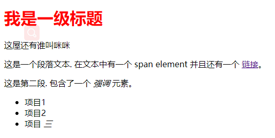
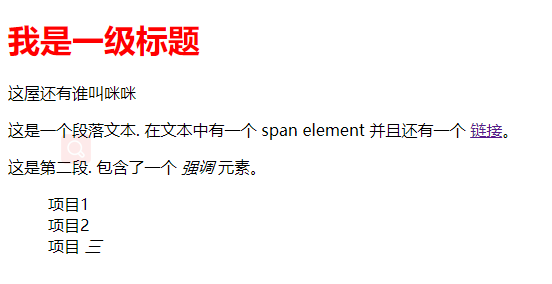
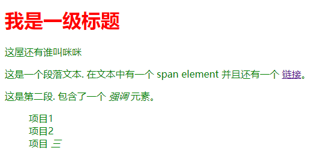
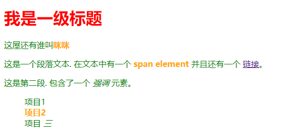
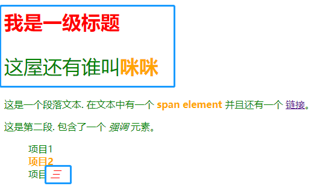
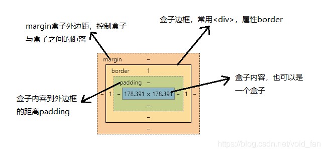
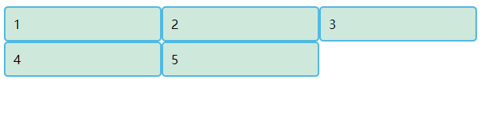
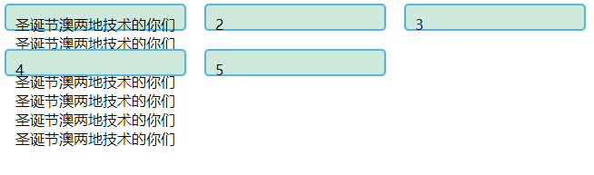
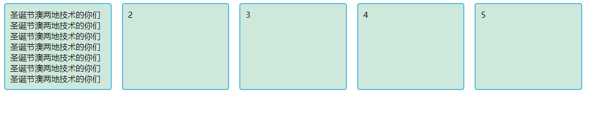

## CSS初识

层叠样式表，可以为html添加样式，如更改内容字体，颜色，大小和间距，设置网页布局，设置背景，添加动画等，使得html表现更加美观

### 语法

CSS是一门基于规则的语言 —— 你能定义用于你的网页中特定元素样式的一组规则。比如“我希望页面中的主标题是红色的大字”

```css
h1 {
    color: red;
    font-size: 5em;
}
```

语法由一个选择器开头，选择HTML的某个元素，接着输入一对大括号，在大括号里定义一个或者多个`property: value;`，给元素设定样式。不同属性接收不同的值，如`color`可接收16进制颜色码，也可以接收rbga，而`font-size`接收数值

:tomato: ​[CSS属性大全](https://developer.mozilla.org/zh-CN/docs/Web/CSS/Reference)

<br>

### 给html添加css

样例代码`index.html`

```html
<!DOCTYPE html>
<html lang="zh-CN">
<head>
	<meta charset="utf-8">
	<title>学习CSS</title>
</head>
<body>
    <h1>我是一级标题</h1>
    <p>这屋还有谁叫<span>咪咪</span></p>
    <p>这是一个段落文本. 在文本中有一个 <span>span element</span>
并且还有一个 <a href="http://example.com">链接</a>。</p>
    <p>这是第二段. 包含了一个 <em>强调</em> 元素。</p>
    <ul>
        <li>项目1</li>
        <li>项目2</li>
        <li>项目 <em>三</em></li>
    </ul>
</body>    
</html>
```

有三种方式给html文档添加css样式，而目前我们更倾向于利用最普遍且有用的方式——在文档的开头链接css

在html文档同级目录创建`style.css`文件，为了把 `styles.css` 和 `index.html` 联结起来，可以在HTML文档中，`<head>`语句模块里面加上下面的代码

```html
<link rel="stylesheet" href="styles.css">
```

`<link>`语句块里面，我们用属性`rel`，让浏览器知道有CSS文档存在（所以需要遵守CSS样式的规定），并利用属性 `href` 指定，寻找CSS文件的位置。现在在样式文件编写如下代码

```css
h1 {
    color: red;
}
```

用浏览器打开html，可以看到`<h1>`字体颜色变为了红色



<br>

### 改变元素的默认行为

通常开发时，会引入一个reset.css清除html元素标签默认自带的样式，比如`<ul>`无序标签，它自带一个项目符号圆点，要去掉可以这样设置

```css
li {
    list-style-type: none;
}
```



前面两个例子通过元素选择器，匹配到了html文档中的所有`h1`和`li`元素，并设置的相应的样式。还可以将不同选择器用**逗号**隔开，一次使用多个选择器，比如选中所有段落p和列表li，使字体变成绿色

```css
p, li {
    color: green;
}
```



<br>

### 使用类名

到目前为止，已经可以通过样式设置html元素，但是你会发现这对所有的相同元素都起作用，这显然是不合理的，称这些选择器为**元素选择器**。html已经提及，大部分元素标签都有三个核心属性，`class`、`id`、`style`，可通过`class`属性作为**类选择器**，对某个元素单独设置样式

```html
<ul>
  <li>项目一</li>
  <li class="special">项目二</li>
  <li>项目 <em>三</em></li>
</ul>
```

在 CSS 中，选中这个`special`类

```css
// .为英文的句号
.special {
  color: orange;
  font-weight: bold;
}
```

有时元素选择器会和类选择器一起出现，意思是选中`li`标签带有类名`special`的元素

```css
li.special {
  color: orange;
  font-weight: bold;
}
```

同样的，也可以一次使用多个选择器

```css
span, li.special {
  color: orange;
  font-weight: bold;
}
```



如果多个元素设置相同类名，一样起作用

<br>

### 选择嵌套元素

观察index.html，里面有两个`<em>`元素，除了给它设置类名外，还能怎么样选择嵌套在`<li>`元素下的`<em>`元素呢？我们可以使用一个称为**包含选择符**的选择器，它只是单纯地在两个选择器之间加上一个空格

```css
li em {
    color: red;
}
```

意思是选择所有在`<li>`元素下的`<em>`元素

另一些可能想尝试的事情是在HTML文档中设置直接出现在标题后面并且与标题具有相同层级的段落样式，为此需在两个选择器之间添加一个 `+` 号 (成为 **相邻选择符**) 

```css
h1 + p {
    font-size: 200%;
}
```



:tomato: CSS 给我们提供了几种定位元素的方法。到目前为止，我们只触及了皮毛

<br>

### 根据状态设定样式

浏览网页时，在操作超链接时，常表现为不同的样式，这取决于这个超链接的状态：未访问过的、访问过的、鼠标悬停的、被键盘定位的、或者是正在被点击的

下面的CSS代码使得没有被访问的链接颜色变为粉色、访问过的链接变为绿色

```css
a:link {
  color: pink;
}

a:visited {
  color: green;
}
```

鼠标悬停时移除下划线并且文字颜色变成红色

```css
a:hover {
    text-decoration: none;
    color: red;
}
```

<br>

### 选择器的组合

你可以将多种类型组合在一起，看起来像这样

```css
body h1 + p .special {
  color: yellow;
  background-color: black;
  padding: 5px;
}
```

<br><br>

## 如何引用CSS

在文档中应用css三种方式

### 外部样式表

上一节的样式引入就是外部样式表，通过将css写入一个css文件，然后在HTML`<link>` 元素引用它，例如

```html
<!DOCTYPE html>
<html lang="zh-CN">
<head>
	<meta charset="utf-8">
	<title>学习CSS</title>
    <link rel="stylesheet" href="styles.css">
</head>
<body>
    <h1>我是一级标题</h1>
</body>    
</html>
```

<br>

### 内部样式表

内部样式表是指不使用外部css文件，而是将css放在HTML文件`<head>`标签的`<style>`标签中，如

```html
<!DOCTYPE html>
<html lang="zh-CN">
<head>
	<meta charset="utf-8">
	<title>学习CSS</title>
    <style>
        h1 {
            color: red;
        }
    </style>
</head>
<body>
    <h1>我是一级标题</h1>
</body>    
</html>
```

<br>


### 内联样式

内联样式表存在于HTML元素的style属性之中，其特点是每个css表只影响一个元素

```html
<!DOCTYPE html>
<html lang="zh-CN">
<head>
	<meta charset="utf-8">
	<title>学习CSS</title>
</head>
<body>
    <h1 style="color: red;">我是一级标题</h1>
</body>    
</html>
```

<br>

<br>

## CSS如何工作

浏览器展示一个文件的过程

1. 浏览器载入一个html文件
2. 将html转化一个DOM（文档对象模型），DOM是文件在计算机内内存的表现形式
3. 接下来，浏览器会拉取该HTML相关的大部分资源，比如嵌入到页面的图片、视频和CSS样式
4. 浏览器拉取到css之后进行解析，根据选择器类型的不同（类，id，元素等）把它们分到不同的`bucket`中。浏览器基于他找到的不同选择器，将不同的规则（元素选择器规则、类选择器规则等）应用在对应的DOM节点中，并添加节点依赖的样式，这个步骤称为`渲染树`
5. 将上述规则应用于渲染树之后，渲染树依照应该出现的结构进行布局
6. 网页展示在屏幕，这一步称为着色

<br>

<br>

## 关于DOM

一个DOM有一个**`树形`**结构，html中的每一个元素、属性以及每一段文字都对应着结构树中的一个节点。节点由节点本身和其他DOM节点的关系定义，有些节点有父节点，有些节点有兄弟节点（同级节点）

例如

```html
<p>
  Let's use:
  <span>Cascading</span>
  <span>Style</span>
  <span>Sheets</span>
</p>
```

它的树形结构为

```html
p
|--"Let's use"
|-- span
|     |- "cascading"
|-- span
|     |- "Style"
|-- span
      |- "Sheets"
```


<br>

<br>

## 构建CSS

CSS有三个非常重要的特性：`层叠性`、`继承性`、`优先级`（权重）

[优先级比较](https://blog.csdn.net/void_fan/article/details/109840309)

<br>

<br>

## 选择器

前面的内容已经涉及一些选择器了，如元素选择器、类选择器，如果有多个相同的css，可以将它们写成一个选择器列表

```css
h1, p {
	color: red;
}
```

:pencil: 需要注意的是，如果任意一个选择器写错，则整条样式规则将会被忽略掉

<br>

### 选择器种类

| 选择器名称                                                   | 示例              |
| ------------------------------------------------------------ | ----------------- |
| 元素选择器                                                   | h1 { }            |
| 类选择器                                                     | .{ }              |
| id选择器                                                     | #{ }              |
| 标签属性选择器                                               | a[titke] { }      |
| [伪类选择器](https://developer.mozilla.org/zh-CN/docs/Learn/CSS/Building_blocks/Selectors/Pseudo-classes_and_pseudo-elements) | p:first-child { } |
| 伪元素选择器                                                 | p::first-line { } |
| 通配选择器                                                   | * { }             |
| 后代选择器                                                   | div p { }         |
| 子代选择器                                                   | div > p           |
| 相邻兄弟选择器                                               | h1 + p            |
| 通用兄弟选择器                                               | h1 ~ p            |

<br>

<br>

## 盒模型

在 CSS 中，所有的元素都被一个个的“盒子（box）”包围着，理解这些“盒子”的基本原理，是我们使用CSS实现准确布局、处理元素排列的关键

在 CSS 中我们广泛地使用两种“盒子” —— **块级** **盒子** (**block box**) 和 **内联盒子** (**inline box**)，这两种盒子会在**页面流**（page flow）和**元素之间的关系**方面表现出不同的行为：

一个被定义成块级的（block）盒子会表现出以下行为：

* 盒子会在内联的方向上扩展并占据父容器在该方向上的所有可用空间，在绝大数情况下意味着盒子会和父容器一样宽
* 每个盒子都会换行
* `width`和`height`可以发挥作用
* 内边距（padding）, 外边距（margin） 和 边框（border） 会将其他元素从当前盒子周围“推开“

<br>

如果一个盒子对外显示为 `inline`，那么他的行为如下：

* 盒子不会产生换行
* `width`和`height`属性无作用
* 垂直方向的内边距、外边距以及边框会被应用但是不会把其他处于 `inline` 状态的盒子推开
* 水平方向的内边距、外边距以及边框会被应用且会把其他处于 `inline` 状态的盒子推开

<br>

css一个盒子模型看起来像这样：




<br>

<br>

## CSS布局

### 介绍css布局

CSS页面布局技术允许我们拾取网页中的元素，并且控制它们相对正常布局流、周边元素、父容器或者主视口/窗口的位置。将涉及到：

* 正常布局流
* `display`属性
* 弹性盒子
* 网格
* 浮动
* 定位
* css表格布局
* 多列布局

<br>


### 正常布局流

正常布局流是指在不对页面进行任何布局控制时，浏览器默认的html布局方式。当你使用css创建布局时，你正在远离**正常布局流**，下列布局技术会覆盖默认的布局行为：

* `diaplay`：标准的value,比如`block`, `inline` 或者 `inline-block` 元素在正常布局流中的表现形式。或是新的布局，`grid`，`flex`
* 浮动：`float`属性，如`left`，能让**块级**元素能排列在一行之内
* `position`属性：正常布局流中，默认值为`static`
* 表格布局：表格布局方式可以使用在非表格内容上，`display: table`
* 多列布局：`Multi-column layout`属性，可以让块按列布局，比如报纸的内容就是一列一列排布的

默认情况下，元素是怎么布局的？

首先，取得元素的内容放在一个元素盒子里，默认的，块级元素的内容是其父元素的100%，其高度与内容高度一致。而内联元素的宽高与内容一致，无法设置宽高，要想设置需要为元素添加样式`display: block`或者`display: inline-block`

根据元素类型的不同，元素之间的互相影响不一致：在正常布局流中，块级元素会在上一个元素下面另外起一行，它们会被设置好的margin分隔；而内联元素则不同，它们不会另外新起一行，只要父级块级元素有足够的空间，它们与其他内联元素、文本内容被安排在一行，只有行空间不够时，溢出的内容才会移到新的一行

如果两个相邻的元素都设置了margin 并且两个margin有重叠，那么更大的设置会被保留，小的则会消失 --- 这被称为外边距叠加

<br>

### 弹性盒子

弹性盒子是一种用于按行或按列布局元素的一维布局方法 。元素可以膨胀以填充额外的空间, 收缩以适应更小的空间

要想设置为弹性盒子，需要给这些要设置的元素的父元素设置

```css
div {
    display: flex;
}
```

flex模型说明


- **主轴（main axis）**是沿着 flex 元素放置的方向延伸的轴（比如页面上的横向的行、纵向的列）。该轴的开始和结束被称为 **main start** 和 **main end**。
- **交叉轴（cross axis）**是垂直于 flex 元素放置方向的轴。该轴的开始和结束被称为 **cross start** 和 **cross end**。
- 设置了 `display: flex` 的父元素被称之为 **flex 容器（flex container）。**
- 在 flex 容器中表现为弹性的盒子的元素被称之为 **flex 项**（**flex item**）

此外，要设置flex主轴方向，要用到`flex-direction`属性，默认值是row，横向

```css
div {
    flex-direction: row;
    flex-direction: row-reverse;//反向
	flex-direction: column;
    flex-direction: column-reverse;//反向
}
```

当在该布局中使用定宽或者定高的时候，可能会出现问题即处于容器中的 弹性盒子子元素会溢出，破坏了布局

解决此问题的一种方法是将以下声明添加到 css 规则中：

```css
flex-wrap: wrap;
```

这样，flex项当空间不足时就会自动换行

属性`flex-flow`，组合了`flex-direction`和`flex-wrap`

```css
flex-flow: row wrap;
```

flex布局通常按照比例分配空间，例如有三个flex项目

```css
.div1 {
    flex: 1;
}

.div2 {
    flex: 1;
}

.div3 {
    flex: 2;
}
```

这样，就把一行的空间平均分了4份，div1和div2占一份，而div3占了一半，还可以指定每一flex项目的最小值

```css
flex: 1 200px;
```

每个flex项目可以通过order来进行排序

```css
.div1 {
    order: 1;
}
```

* 所有 flex 项默认的 `order` 值是 0
* order 值大的 flex 项比 order 值小的在显示顺序中更靠后
* 相同 order 值的 flex 项按源顺序显示。所以假如你有四个元素，其 order 值分别是2，1，1和0，那么它们的显示顺序就分别是第四，第二，第三，和第一
* 第三个元素显示在第二个后面是因为它们的 order 值一样，且第三个元素在源顺序中排在第二个后面
* 你也可以给 order 设置负值使它们比值为 0 的元素排得更前面

<br>

### 网格

一个网格通常具有许多的**列（column）**与**行（row）**，以及行与行、列与列之间的间隙，这个间隙一般被称为**沟槽（gutter）**，在流行的ui框架中，如ant design，也能找到这些网格概念


首先，将容器的`display`属性设置为`grid`来定义一个网络。与弹性盒子一样，将父容器改为网格布局后，他的直接子项会变为网格项。把下面的css规则加到你的文件中

```css
display: grid;
```

与弹性盒子不同的是，在定义网格后，网页并不会马上发生变化。因为`display: grid`的声明只创建了一个只有一列的网格，所以你的子项还是会像正常布局流那样从上而下一个接一个的排布

为了让我们的容器看起来更像一个网格，我们要给刚定义的网格加一些列。那就让我们加三个宽度为`200px`的列。当然，这里可以用任何长度单位，包括百分比

```css
.container {
	display: grid;
    grid-template-columns: 200px 200px 200px;
}
```

下列代码将在浏览器表现为

```html
<!DOCTYPE html>
<html lang="zh-CN">
<head>
	<meta charset="utf-8">
	<title>学习CSS</title>
</head>
<style>
.container {
	display: grid;
    grid-template-columns: 200px 200px 200px;
}
.container > div {
    border-radius: 5px;
    padding: 10px;
    background-color: rgb(207,232,220);
    border: 2px solid rgb(79,185,227);
}
</style>
<body>
    <div class="container">
		<div>1</div>
		<div>2</div>
		<div>3</div>
		<div>4</div>
		<div>5</div>
	</div>
</body>    
</html>
```



除了长度和百分比，我们也可以用`fr`这个单位来灵活地定义网格的行与列的大小。这个单位表示了可用空间的一个比例，就像flex一样

```css
.container {
    display: grid;
    grid-template-columns: 1fr 1fr 1fr;
}
```

:tomato: 注意`fr`分配的是可用空间

使用 [`grid-column-gap` (en-US)](https://developer.mozilla.org/en-US/docs/Web/CSS/column-gap) 属性来定义列间隙；使用 [`grid-row-gap` (en-US)](https://developer.mozilla.org/en-US/docs/Web/CSS/row-gap) 来定义行间隙；使用 [`grid-gap` (en-US)](https://developer.mozilla.org/en-US/docs/Web/CSS/gap) 可以同时设定两者

```css
.container {
    display: grid;
    grid-template-columns: 2fr 1fr 1fr;
    grid-gap: 20px;
}
```

间隙距离可以用任何长度单位包括百分比来表示，但不能使用`fr`单位

`grid-template-columns`属性，可以通过`repeat`函数来重复构建具有某些宽度配置的某些列

```css
.container {
    display: grid;
    grid-template-columns: repeat(3, 1fr);
    grid-gap: 20px;
}
```

<br>

到目前为止，我们定义过了列，但还没有管过行。但在这之前，我们要来理解一下显式网格和隐式网格。显式网格是我们用`grid-template-columns` 或 `grid-template-rows` 属性创建的。而隐式网格则是当有内容被放到网格外时才会生成的

简单来说，隐式网格就是为了放显式网格放不下的元素，浏览器根据已经定义的显式网格自动生成的网格部分。隐式网格中生成的行/列大小是参数默认是`auto`，大小会根据放入的内容自动调整。当然，你也可以使用[`grid-auto-rows`](https://developer.mozilla.org/zh-CN/docs/Web/CSS/grid-auto-rows)和[`grid-auto-columns`](https://developer.mozilla.org/zh-CN/docs/Web/CSS/grid-auto-columns)属性手动设定隐式网格的大小

```css
.container {
  display: grid;
  grid-template-columns: repeat(3, 1fr);
  grid-auto-rows: 30px;
  grid-gap: 20px;
}
```

例如，将隐式网格设置为30px，

```html
<!DOCTYPE html>
<html lang="zh-CN">
<head>
	<meta charset="utf-8">
	<title>学习CSS</title>
</head>
<style>
.container {
	display: grid;
    grid-template-columns: 200px 200px 200px;
	grid-auto-rows: 30px;
	grid-gap: 20px;
}
.container > div {
    border-radius: 5px;
    padding: 10px;
    background-color: rgb(207,232,220);
    border: 2px solid rgb(79,185,227);
}
</style>
<body>
    <div class="container">
		<div>圣诞节澳两地技术的你们圣诞节澳两地技术的你们圣诞节澳两地技术的你们圣诞节澳两地技术的你们圣诞节澳两地技术的你们圣诞节澳两地技术的你们圣诞节澳两地技术的你们</div>
		<div>2</div>
		<div>3</div>
		<div>4</div>
		<div>5</div>
	</div>
</body>    
</html>
```



隐式网格变小了，不能容纳更多文字

要为隐式网格设置一个最小值，而且可以跟随内容自动拓展尺寸以保证容纳所有内容，可以用到`minmax`函数，我们给`grid-auto-rows`设置

```css
grid-auto-rows: minmax(100px, auto);
```

<br>

将`repeat`与`minmax`结合起来，让网格自动创建很多列来填满整个容器。通过设置`grid-template-columns`属性，我们可以实现这个效果，不过这一次我们会用到`repeat`函数中的一个关键字`auto-fill`来替代确定的重复次数

```css
.container {
	display: grid;
    grid-template-columns: repeat(auto-fill, minmax(200px, 1fr));
	grid-auto-rows: minmax(100px, auto);
	grid-gap: 20px;
}
```



<br>

### 浮动

浮动的框可以向左或向右移动，直到它的外边缘碰到包含框或另一个浮动框的边框为止。由于浮动框不在文档的普通流中，所以文档的普通流中的块框表现得就像浮动框不存在一样

```css
float: left;
float: right;
float: none;
float: inherit;
```

清除浮动

在所要清除的元素后新增一个没有意义的标签，给标签使用`clear`属性

```html
<div class="clearfix"></div>
```

```css
.clearfix {
  clear: both;
}
```


<br>

### 定位

css中使用`position`指定元素定位类型

* `static` 默认定位，即没有定位，遵循正常的文档流对象
* `relative` 相对定位，相对定位元素的定位是相对其正常位置
* `fixed`  固定定位，元素的位置相对于浏览器窗口是固定位置
* `absolute` 绝对定位，绝对定位的元素的位置相对于最近的已定位父元素，如果元素没有已定位的父元素，那么它的位置相对于`<html>`
* `stickly` 相对定位和固定定位的混合体

元素可以使用的顶部，底部，左侧和右侧属性定位。然而，这些属性无法工作，除非是先设定position属性。他们也有不同的工作方式，这取决于定位方法。

* `top`
* `right`
* `bottom`
* `left`

定位可能导致元素重叠，可以设置`z-index`，只接受无单位数值，值越大，元素越排前


<br>

### 多列布局

带有 `.container` 的div将成为我们多列布局的容器。 通过这两个属性`column-count`或者`column-width`开启多列布局，通过以下，你将得到3列

```css
.container {
  column-count: 3;
  //浏览器按照你指定的宽度尽可能创建多的列
  //这意味着你可能无法期望得到你指定宽度
  column-width: 200px;
}
```

加入列间隙

```css
.container {
  column-width: 200px;
  column-gap: 20px;
}
```

`column-rule`，与`border`属性类似

```css
.container {
  column-count: 3;
  column-gap: 20px;
  column-rule: 4px dotted rgb(79, 185, 227);
}
```


<br>

### 媒体查询入门

**CSS媒体查询**为你提供了一种应用CSS的方法，仅在浏览器和设备的环境与你指定的规则相匹配的时候CSS才会真的被应用，例如“视口宽于480像素”的时候

基础语法

```css
@media media-type and (media-feature-rule) {
  /* CSS rules go here */
}
```

- 一个媒体类型，告诉浏览器这段代码是用在什么类型的媒体上的（例如印刷品或者屏幕），类型包括`all` `print` `screen` `speech`
- 一个媒体表达式，是一个被包含的CSS生效所需的规则或者测试
- 一组CSS规则，会在测试通过且媒体类型正确的时候应用

例如，要想在视口正好是600像素的时候，让body的文本变为红色，你可能会使用下面的媒体查询

```css
@media screen and (width: 600px) {
    body {
        color: red;
    }
}
```

`width`（和`height`）媒体特征可以以数值范围使用，于是就有了`min-`或者`max-`的前缀，指示所给的值是最小值还是最大值。例如，要让颜色在视口窄于400像素的时候变成蓝色的话，可以用`max-width`：

```css
@media screen and (max-width: 400px) {
    body {
        color: blue;
    }
}
```

一个受到良好支持的媒体特征是`orientation`，我们可以用它测得竖放（portrait mode）和横放（landscape mode）模式

```css
@media (orientation: landscape) {
    body {
        color: rebeccapurple;
    }
}
```

<br>

媒体查询与逻辑

```css
@media screen and (min-width: 400px) and (orientation: landscape) {
    body {
        color: blue;
    }
}
```

媒体查询或逻辑

```css
@media screen and (min-width: 400px), screen and (orientation: landscape) {
    body {
        color: blue;
    }
}
```

媒体查询非逻辑，你可以用`not`操作符让整个媒体查询失效

```css
@media not all and (orientation: landscape) {
    body {
        color: blue;
    }
}
```

<br>

<br>

## 样式化文字

