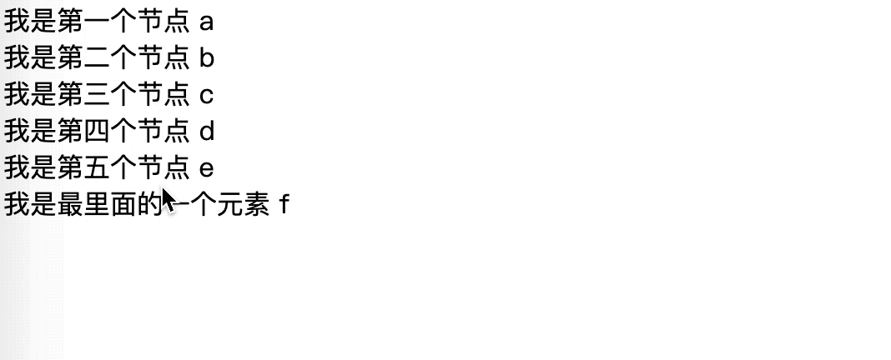
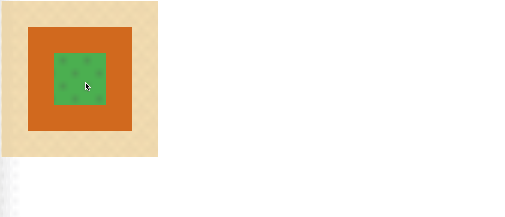

# JavaScript

> JavaScript ( JS ) 是一种具有函数优先的轻量级，解释型或即时编译型的编程语言。(MDN)

`JavaScript` 是一种编程语言，主要参与构建 Web 前端应用。

- [JavaScript](#javascript)
  - [基础](#基础)
    - [变量](#变量)
    - [数据类型](#数据类型)
    - [if语句](#if语句)
    - [for语句](#for语句)
    - [算数运算符](#算数运算符)
    - [比较运算符](#比较运算符)
    - [逻辑运算符](#逻辑运算符)
    - [表达式](#表达式)
    - [函数](#函数)
    - [对象](#对象)
    - [字符串](#字符串)
    - [数字](#数字)
    - [数组](#数组)
    - [switch语句](#switch语句)
    - [while语句](#while语句)
    - [document.cookie](#documentcookie)
  - [内置对象](#内置对象)
    - [Function](#function)
    - [Math](#math)
    - [Date](#date)
    - [RegExp](#regexp)
    - [JSON](#json)
  - [JavaScript 与 DOM](#javascript-与-dom)
    - [什么是 DOM](#什么是-dom)
    - [获取和操作 DOM 节点](#获取和操作-dom-节点)
    - [DOM 与事件](#dom-与事件)
    - [DOM 事件绑定](#dom-事件绑定)
    - [DOM 事件对象](#dom-事件对象)
    - [DOM 事件流](#dom-事件流)

<br>

## 基础

<br>

### 变量

<br>

> 变量来源于数学，是计算机语言中能储存计算结果或能表示值抽象概念。

变量就是`存放一些内容`的`容器`。

1. 声明变量

```javascript
var 变量名 = 1;
console.log(变量名); // 输出：1
```

上述代码声明了一个`变量名`，并把它设置为数值1，然后`console.log`输出变量的值。虽然使用中文作为变量名在 `chrome` 浏览器下没有报错，但是还是不建议使用。

常规场景中**不会有使用中文名作为变量的情况**

2. 给变量赋值

```javascript
var result = 0;
var number1 = 1;
var number2 = 2;
var result = 1 + 2;
var result = number1 + number2;

//改变变量的值
var string = '今天加班？';
console.log(string); // 输出：今天加班？
string = '福报！';

//声明变量但是不赋值
var result;
console.log(string); // 输出：undefined
```

3. 变量命名规范

* 变量名必须使用`字母`、`下划线(_)`、`美元符号($)`开头
* 变量名对大小写敏感
* 不能使用关键字作为变量名
* 变量命名遵循语义化，符合上下文语境，要做到见名知义

4. 常量

常量就是定义并赋值后再也不能修改的量，通常一些不会改变的量，如配置、物理值等会声明为常量，在 ES6 之前是没有提供常量这一特性的。采用约定的形式，通常常量都是大写，不同单词之间用下划线分隔

```javascript
var PI = 3.1415926535;

var DB_ACCOUNT = 'root';
var DB_PASSWORD = 'root';
```

<br>

### 数据类型

<br>

数据类型就是 JavaScript 中可操作的数据的类型。

数据类型分为`值类型`与`引用类型`。

在 ES6 之前，主要有以下数据类型：

- 值类型

  - 字符串
  - 数字
  - 布尔
  - null
  - undefined

- 引用类型

  - 对象
  - 数组
  - 函数

  <br>

1. 值类型

```javascript
var str1 = '字符串1';
var str2 = "字符串2"; //可用单引号或者双引号

var num1 = 4;
var num2 = .1;
var num3 = 0.5;
var num4 = -20;
//如果数字的大小超过最大值或者最小值，
//那他的值在 JavaScript 中会表示为 Infinity 和 -Infinity

var flag = true;
var isEmpty = false;
//null undefined NaN 0 空串在转化为布尔值时为 false

var obj = null;
//表示对象的值未设置，也可以简单理解成空，什么都没有

var age;
//一个变量在声明后如果没有赋值，他的值就是undefined
//undefined既是一种数据类型，在浏览器中又是作为全局变量存在的，
//也就是window对象下的一个属性
```

2. 引用类型

**函数**其实是一段 `JavaScript` 代码，调用函数就会执行函数中的代码。

使用 `function` 关键字就可以定义一个函数，简单的函数语法如下

```javascript
function add(arg1, arg2) {
  var sum = arg1 + arg2;
  return sum;
}

var result = add(1,2);
console.log(result);//输出：3
```

<br>

**对象**由属性和方法组成。

```javascript
//采用字面量创建对象
var obj = {
	age: 24,
    name: 'zlfan',
    'hobby': 'games',
    say: function(){
        console.log('hello')
    }
}

//通过 new Object 创建对象
var obj = new Object();
obj.age = 24;
obj.name = 'zlfan';
```

通过`对象.属性`就可以访问到对象属性的属性值，如果属性名是一个不符合变量命名规范的值，则可以通过`对象['属性名']`进行访问，方法同理，因为本质上方法也是属性

:tomato: 通过`对象.属性 = 属性值`的方式就可以设置一个属性和属性值，这一方式遵循以下规则：

- 如果要赋值的属性不存在，则会创建这个属性并赋值
- 如果要赋值的属性存在，则会修改这个属性的值

<br>

**数组**是一组数据构成的列表。数组由中括号包裹，每一项通过`逗号`进行分隔：

```javascript
var arr = [1, '2', 3, 4, 5];

console.log(arr[0]); // 输出：1
console.log(arr[1]); // 输出："2"
```

数组可以理解成一种特殊的对象，他原生具有一些属性和方法，如数组长度属性和遍历数组：

```javascript
var arr = ['a', 'b', 'c'];

console.log(arr.length);//输出：3

arr.forEach(function(item, index) {
  console.log(item, index); // "a" 0, "b" 1, "c" 2
});
```

<br>

**值类型和引用类型的区别**

从内存角度出发，值类型放在内存栈中，引用类型则放在内存堆中。

引用类型的数据本身是指向内存上的一块地址，操作的时候对地址上的值进行操作。

而值类型直接操作值，不论是复制或是修改都是直接产生一个新的值。

```javascript
var obj1 = {
  name: '小明',
};

var obj2 = obj1;

obj2.name = '小红';

console.log(obj1.name); // 输出：小红


var val1 = 1;
var val2 = val1;

val2 = 2;
console.log(val1); // 输出：1
```

通过上面的例子就可以看出引用类型和值类型在 JavaScript 程序中的区别。

引用类型在进行复制的时候，其实就是多了一个引用，操作的值是同一个。

而值类型进行复制后，则是一个新的值。

<br>

### if语句

<br>

在程序中 if 语句属于条件语句的一种

```javascript
// 方式1
if (条件) {
  // 条件满足做的事情;
}

// 方式2
if (条件) 条件满足时候做的事情;
```

```javascript
var score = 99;

if (score > 60) {
  console.log('及格了'); // 输出："及格了"
}

if (score > 90) {
  console.log('优秀！'); // 输出："优秀！"
}
```

if 语句可以仅有单个分支也可以有多个分支。

```javascript
var score = 77;

if (score >= 60) {
  console.log('及格了');
} else {
  console.log('不及格');
}

// 输出："及格了"
```

```javascript
var score = 88;

if (score < 60) {
  console.log('不及格');
} else if (score < 80) {
  console.log('良好');
} else if (score < 90) {
  console.log('优秀！');
} else {
  // 剩下的肯定是大于等于九十的情况
  console.log('太强了！');
}

// 输出："优秀！"
```

<br>

### for语句

<br>

for 语句是循环语句中的一种，使程序在某一个条件下重复执行一段代码。

```javascript
for (初始语句; 条件; 条件为真值时执行的语句) {
  // 循环体
}
```

例如，输出1-10

```javascript
for(var i = 1; i <= 10; i++){
    console.log(i)
}
```

除此之外，还有一种遍历对象的方式：`for...in`

```javascript
var obj = {
  name: '小红',
  age: 12,
  hobby: ['打篮球', '唱歌'],
};

for (key in obj) {
  console.log(obj[key]);
}

// 输出：
//   "小红"
//   12
//   ["打篮球", "唱歌"]
```

:tomato: 特别注意：循环一定要有结束条件，否则程序将永远运行至浏览器卡死。

**for 语句中的 `break` 和 `continue`**

```javascript
//特殊的累加，假设遇到的值为 4 就停止累加，并且不对 2 进行累加
var arr = [1, 2, 3, 4, 5], i;
var sum = 0;

for(i = 0; i < arr.length; i++){
    if(arr[i] == 2) continue;
    if(arr[i] == 4) break;
    sum += arr[i];
}

console.log(sum);//输出：4
```

* `break`，中断整个循环
* `continue`，结束本次循环，执行下次循环

<br>

### 算数运算符

<br>

> 算术运算符以数值（字面量或变量）作为其操作数，并返回一个单个数值。标准算术运算符是加法（+），减法（ - ），乘法（*）和除法（/）。—— MDN

JavaScript 中有三元运算符、二元运算符、一元运算符。

与算数相关的只有二元与一元运算符：

二元运算符：

- `+` 加法
- `-` 减法
- `*` 乘法
- `/` 除法：在许多强类型的语言中，整数相除即便无法除尽，结果必然是整数，但在 JavaScript 中，整数相除如果无法除尽，也会返回小数部分。
- `%` 求余
- `**` 幂 （ES2016 提案）：2 ** 3 表示2的3次方 = 8

一元运算符：

- `+` 一元正号
- `-` 一元负号
- `++` 递增
- `--` 递减

运算符**优先级**：

`括号` > `后置递增/后置递减` > `一元加法/一元减法/前置递增/前置递减` > `幂` > `乘法/除法/取模` > `加法/减法`

<br>

### 比较运算符

<br>

比较运算符用于比较两个表达式的结果，分为`相等运算符`与`关系运算符`。

相等运算符：

- `==` 相等
- `!=` 不相等
- `===` 严格相等
- `!==` 严格不相等

关系运算符：

- `>` 大于
- `>=` 大于等于
- `<` 小于
- `<=` 小于等于

运算符返回的都是布尔值。

运算符左右的值也被称为操作数。

如果比较的两个操作数是引用类型，则会比较内部的引用（是否引用同一个内存地址上的值）。


**相等与严格相等的比较区别//////不相等与严格不相等的比较区别：**

相等(==)会对不同类型的比较数据进行隐式转换，严格相等在比较的时候，碰到两边的操作数类型不同，则会直接返回 `false`，不会进行类型的转换。

例如

```javascript
var a = 1, b = '1';

console.log(a==b);//true
console.log(a===b);//false
```

<br>

### 逻辑运算符

<br>

> 逻辑运算符通常用于布尔型（逻辑）值。这种情况下，它们返回一个布尔值。然而，&& 和 || 运算符会返回一个指定操作数的值，因此，这些运算符也用于非布尔值。这时，它们也就会返回一个非布尔型值。—— MDN

JavaScript 中的逻辑运算有三种：

- `&&` 与 (并且)
- `||` 或 (或者)
- `!` 非 (取反)

**与操作符**在左侧的表达式结果为 `true` 或者可以`隐式转换为true`的时候，会返回右侧表达式结果，否则返回左侧表达式结果。

```javascript
true && true; // true
true && false; // false
false && true; // false
false && false; // false
```

**或操作符**在当有表达式的结果为 true 或者可以隐式转换为 true 的时候，就返回这个表达式的结果，如果没有则返回右侧表达式的结果。

```javascript
true || true; // true
true || false; // true
false || true; // true
false || false; // false
```

**非**就是取反。表达式结果如果是布尔值，则会直接取反，结果如果不是布尔值，则会转换成布尔值再取反。

```javascript
!true; // false
!false; // true

!0; // true
!''; // true

!1; // false
```

**双重非**，就是使用两个非，通常用于将一种数据类型转换成布尔值。

```javascript
!!1; // true
```

<br>

### 表达式

<br>

> 表示式亦称表达式、运算式或数学表达式，在数学领域中是一些符号依据上下文的规则，有限而定义良好的组合。数学符号可用于标定数字（常量）、变量、操作、函数、括号、标点符号和分组，帮助确定操作顺序以及有其它考量的逻辑语法。——Wikipedia

表达式可以简单理解成一种式子，如 `2 + 3` 就是一种表达式，通常会叫做算术表达式。如

```javascript
var a = 1;
var b = 2;
var c = 3;

var res = ((a + b) - (c * sqrt(9)));
```

其中 res 等号右边就是一个算术表达式，其由多个算术表达式组成。

1. 原始表达式

变量、关键字、字面量都属于原始表达式。

```javascript
var num = 1;

num; // 变量 原始表达式
'123'; // 字符串字面量 原始表达式
this; // 关键字 原始表达式
```

2. 复合表达式

原始表达式加上运算符就形成了复合表达式。

```javascript
10 * 10; // 两个数字字面量 使用乘号连接
```

3. 定义表达式

定义表达式及定义一个变量。

```javascript
var person;
var func;
```

4. 初始化表达式

`初始化表达`式`与定义表达式`不同，`初始化表达式`在定义变量的同时对变量做了初始化。

```javascript
var number = 10000;
var fn = function() {};
```

<br>

### 函数

<br>

> 在 JavaScript中，函数是头等 (first-class) 对象，因为它们可以像任何其他对象一样具有属性和方法。它们与其他对象的区别在于函数可以被调用。简而言之，它们是 Function 对象。(MDN)

1. 函数的使用

```javascript
// 常见的函数的定义方式
function 函数名(参数1, 参数2, ...) {
  代码片段;

  return 返回值;
}

// 调用函数 (执行函数中的代码)
var 函数的返回值 = 函数名(参数1, 参数2, ...);
```

- 调用函数就是执行函数中的代码
- 参数是调用函数的时候传递过去的，在函数执行过程中可以访问到
- 函数执行完毕后可以有一个返回值，调用函数的地方可以接收到这个返回值

改造如下：

```javascript
function say(arg) {
  return "hello" + arg;
}

var fn = say(1); 
console.log(fn);// 输出："hello1"
```

2. 函数名命名规范

* 单词拼写要准确，尽量不使用拼音或者混用拼音拼写
* 判断`是否`、`有没有`,`可以`的时候，带上一些前缀，如 is
* 合理使用缩写，如 password 为 pwd，delete 为 del

3. 函数作用域

函数有他自己的作用域，函数内声明的变量等`通常情况下`不能被外部访问，但是函数可以访问到外部的变量或者其他函数等

```javascript
var a = 1;

function fn() {
    var b = 2;

    console.log(a); // 输出：1
    console.log(b); // 输出：2
}

fn();

console.log(b); // ReferenceError: b is not defined
```

4. 匿名函数

没有名字的函数就是一个匿名函数

```javascript
var fn = function() {
    console.log('我是一个匿名函数');
};

//相对常见的一个就是自执行匿名函数，MDN官方翻译为立即调用函数表达式。
//浏览器加载完html后，立即执行该段代码，弹出对话框
(function() {
    var num = 1;
    alert(num);
})();
```

5. 具有函数名的函数表达式

函数表达式进行声明的时候也可以使用具名函数

```javascript
var count = function fn(num) {
    console.log('我是一个函数');
};
```

以上这段代码是不会报错的，但是不能通过 `fn` 访问到函数，这里的 `fn` 只能在函数内部进行访问，通常在使用递归的形式做计算的时候会用到这种写法。

```javascript
var count = function fn(num) {
    if (num < 0) {
        return num;
    }

    return fn(num - 1) + num;
}

count(5);
```

6. **arguments**

> arguments 是一个对应于传递给函数的参数的类数组对象。(MDN)

通常情况下函数都具有 `arguments` 对象，可以在函数内部直接访问到。他是一个类数组，即长得很像数组，成员都是用数字编号，同时具有 length 属性。arguments 中存放着当前函数被调用时，传递过来的所有参数，即便**不声明参数，也可以通过 arguments 取到传递过来的参数**。

```javascript
function sum() {
    console.log(arguments);
}

sum(1, 2, 3, 4);
//输出：Arguments(4) [1, 2, 3, 4, callee: ƒ, Symbol(Symbol.iterator): ƒ]
```

通过下标按顺序访问传递的参数

```javascript
//arguments[0];
//arguments[1];
var total = 0, i, len;
for (i = 0, len = arguments.length; i < len; i++) {
    total += arguments[i];
}
```

7. 纯函数与副作用

一个函数从执行开始到结束，没有对外部环境做任何操作，即对外部环境没有任何影响（没有副作用），这样的函数就是纯函数。纯函数只负责输入输出，对于一种输入只有一种函数返回值。

```javascript
// 纯函数
function add(a, b) {
  return a + b;
}

// 非纯函数
var person = { name: '小明' };
function changeName {
  person.name = '小红'; // 影响了函数外的内容，产生了副作用
}
```

8. 构造函数

当一个函数与 `new` 关键字一起被调用的时候，就会作为一个构造函数。

```javascript
function Person(name, age) {
    this.name = name;
    this.age = age;
}

Person.prototype.say = function() {
    console.log('我是' + this.name);
};

var person = new Person('阿梅', 12);

person.say();

console.log(person);
```

可以看到当函数作为构造函数调用的时候，默认返回的是一个对象。

细心的读者仔细观察就能发现，构造函数的默认返回值是函数体内的 this。

事实上构造函数的执行有一定流程：

1. 创建一个空对象，将函数的this指向这个空对象
2. 执行函数
3. 如果函数没有指定返回值，则直接返回 this（一开始创建的空对象），否则返回指定返回值

理解这个流程，就能理解构造函数的返回值。

<br>

### 对象

<br>

JavaScript 中的对象由`属性`和`方法`组成。属性可以是任意 JavaScript 中的数据类型，方法则是一个函数。

1. 创建对象

```javascript
var person = {
    age: 24,
    name: 'zlfan'
};

//通过 new Object()
var person = new Object();
```

`Object.create`，也可以创建一个新对象，但是必须传递一个对象作为参数。

```javascript
var zlfan = Object.create(person);
```

`Object.create` 会根据传递过去的对象生成一个新的对象，作为参数传递的对象会作为新对象的原型。

2. 操作对象

访问对象属性

```javascript
//对象.属性名
//对象['属性名']

var obj = {
  key: 'value',
  say: function() {
    console.log('never 996');
  },
};

console.log(obj.key); // 输出："value"
console.log(obj['key']); // 输出："value"

obj.say(); // 输出："never 996"
obj['say'](); // 输出："never 996"
```

当试图访问一个不存在的属性的时候，则会返回 `undefined`。

遍历对象

```javascript
//通过 Object.keys 拿到 key 数组再遍历
var person = {
  age: 27,
  name: '鸽手',
};

Object.keys(person).forEach(function(key) {
  console.log(person[key]);
});

//通过 for...in
var obj = {
  name: '小红',
  age: 12,
  hobby: ['打篮球', '唱歌'],
};

for (key in obj) {
  console.log(obj[key]);
}
```

设置属性值，同访问对象的形式

<br>

### 字符串

<br>

JavaScript 支持以下特殊字符的转义：

| \\'  | 单引号 |
| ---- | ------ |
| \\"  | 双引号 |
| \\&  | 和号   |
| \\\  | 反斜杠 |
| \\n  | 换行符 |
| \\r  | 回车符 |
| \\t  | 制表符 |
| \\b  | 退格符 |
| \\f  | 换页符 |

字符串常用属性及方法：

1. 访问

```javascript
//length
var str = "asgrhg";
console.log(str.length);

//访问指定下标字符
str[0];
str.charAt(0);
```

2. 大小写

```javascript
//转化大写小写
str.toUpperCase();
str.toLowerCase();
```

3. 查找子串

```javascript
str.indexOf('g');//返回匹配成功的位置，没找则返回-1
str.lastIndexOf('g');//反向查找
```

4. 截取字符串

```javascript
//获取、截取子字符串
str.slice(0, 5);//从0-5的子字符串，不包括5：asgrh
//从右边的第三个位置开始，在右边的第一个位置结束
str.slice(-3, -1); //'rh'
//个人理解：如果是正向，按下标从0开始，左闭右开区间；
//如果是逆向，按从1开始，逆向第一个字符就是-1，左闭右开区间；

str.substring(0, 5);//同slice
//返回从指定位置开始，长为n的子字符串
str.substr(0, 5);
```

5. 字符串与字符数组的互相转换

```javascript
let strArray = str.splite('');//["a", "s", "g", "r", "h", "g"]
strArray.join('');//"asgrhg"
```

<br>

### 数字

<br>

在 JavaScript 只有浮点数（可以理解成带有小数点的数）。

1. 进制

JavaScript 默认十进制，使用 `0b` 开头的数字，就表示二进制；`0` 开头的则为八进制；十六进制用到的相对会多一些，以`0x`开头

```javascript
0b1012; // 报错，因为二进制只有0与1
0b1111; // 15

09; // 控制台输出的9是10进制的，因为八进制中没有9，所以把09解析成了十进制中的9
010; // 8

0xffffff; // 用来表示白色
0xa; // 10
```

**进制转化**

使用 `toString` 方法，在把数字转换成字符串的同时，可以做进制的转换。在调用 `toString` 的时候，可以给定一个基数作为要转换到的进制，范围是 2 到 36 ，默认为 10 。

```javascript
(10).toString(2); // "1010"
(8).toString(8); // "10"
```

使用 parseInt 方法，也可以实现进制转换。

如将二进制数 `1010` 转换成十进制数字：

```javascript
parseInt('1010', 2); // 10
```

parseInt 的第二个参数为进制基数，表示第一个参数是几进制的，返回值为 10 进制。

2. NaN

NaN 即 `Not A Number` ，表示这个值不是一个数字。

`NaN` 基本不会被用到，通常会在两种情况下得到：

* 计算错误
* 将字符串或其他类型转成数字失败

判断一个值是否 NaN，根据NaN 是唯一一个自己不等于自己的值这一特性来判断。

```javascript
NaN === NaN; // false

function isNaN(val) {
  return val !== val;
}

console.log(isNaN(1)); // 输出：false
console.log(isNaN(NaN)); // 输出： true
console.log(isNaN(1 - 'a')); // 输出：true
```

3. window.isNaN 与 Number.isNaN

在 window 下有一个 `isNaN` 方法，在 Number 下也有一个 `isNaN` 方法。

这两个方法区别在于， `window.isNaN` 会将传入的参数转换成数字，转换结果为 `NaN` 就会返回 true ，而后者只有当传入的值确定为 `NaN` 的时候，才会返回 true 。

4. 最大值与最小值

在 `ES6` 中，提供了两个常量 `Number.MAX_SAFE_INTEGER` 与 `Number.MIN_SAFE_INTEGER` ，可以获得到在 JavaScript 可以表示的最大值与最小值（安全数）。

```javascript
Number.MAX_SAFE_INTEGER;// 输出：9007199254740991
Number.MIN_SAFE_INTEGER;// 输出：-9007199254740991
```

在 ES6 中没必要自己去做比较，可以使用 `Number.isSafeInteger()` 方法判断传入的数字是不是一个安全数。

```javascript
Number.isSafeInteger(11111111111111111111); // false

Number.isSafeInteger(996); // true
```

<br>

### 数组

<br>

> 数组是一种使用整数作为键 (integer-key-ed) 属性和长度 (length) 属性之间关联的常规对象。此外，数组对象还继承了 Array.prototype 的一些操作数组的便捷方法。——MDN

数组可以存放多个值。数组的`数`不是指数字，而是指`数据`，数组可以存放任意数据类型的值。

从理论上讲，在内存允许的情况下，数组的长度是无限的。

1. 创建数组

```javascript
var hobby = ['java', 'c', 'c++', 'python', 'javascript', 1, 2, 3, true, false];

console.log(hobby);
```

2. 数组长度

```javascript
var arr = [1, 2, 3, 4, 5];

console.log(arr.length); // 5
```

3. 访问数组成员

```javascript
var arr = [1, 2, 3];

console.log(arr[0]);
console.log(arr[1]);
console.log(arr[2]);
```

4. 遍历数组

```javascript
//数组遍历主要有两种方式：for 与 forEach
var arr = [1, 2, 3, 4, 5], i;

for(i=0; i < arr.length; i++){
    console.log(arr[i]);
}

//item为当前遍历的值，index为当前数组下标，arr为源数组
arr.forEach(function(item,index,arr){
    console.log(item);
})
```

5. 修改数组

```javascript
var arr = [1, 2, 3, 4, 5];

arr[0] = 6;
arr[1] = 7;

console.log(arr);//[6, 7, 3, 4, 5]
```

6. 增减数组

从数组头部与尾部，可分别增减数组

```javascript
//在尾部增减
var arr = [1, 2, 3, 4, 5];
arr.push(6);//[1 ,2 ,3 ,4 ,5 ,6]
arr.pop();//删除最后一项，返回删除的值

//在头部增减
arr.unshift(0);//[0, 1, 2, 3, 4, 5]
arr.shift();//删除第一项，返回删除的值
```

7. 清空数组

```javascript
var arr = [1, 2, 3, 4];

//以下几种均可清空数组
arr.splice(0, arr.length);

arr = [];

arr.length = 0;
```

8. 数组中的 undefined 与 empty

在数组中 undefined 与 empty 是有区别的。

使数组项变成 `empty` 通常有两种方式。

- 使用 Array 对象同时提供了长度创建出来的数组
- 使用 `delete` 关键字删除的数组项

```javascript
var arr1 = new Array(10);

arr1[0] = 1;

var arr2 = [1, 2, 3, 4, 5];

delete arr2[3];

console.log(arr1);//[1, empty × 9]
console.log(arr2);//[1, 2, 3, empty, 5]
```

虽然 empty 的项在访问的时候返回的是 undefined ，但其本身只做简单占位，是遍历不到的。

```javascript
var arr = [1, undefined, 3, 4, 5];

delete arr[3];

arr.forEach(function(item, index) {
  console.log(index, item);
});

var i = 0;
for (i in arr) {
  console.log(i, arr[i]);
}
```

数组中 4 被删除了，上述两个遍历数组均打印

```javascript
0 1
1 undefined
2 3
4 5
```

上面两种遍历的方式都是遍历不到 `empty` 项的，而 `undefined` 是可以遍历到的，这是最主要的区别。

<br>

### switch语句

<br>

> switch 语句评估一个表达式，将表达式的值与case子句匹配，并执行与该情况相关联的语句。—— MDN

```javascript
var num = 3;

switch (num + 1) {
  case 2:
    console.log('case的值是2');
    break;
  case 3:
    console.log('case的值是3');
    break;
  case 4:
    console.log('case的值是4');
  case 5:
    console.log('case的值是5');
  default:
    console.log('没有匹配到值');
}
```

上面语句将会打印

```javascript
case的值是4 
case的值是5
没有匹配到值
```

这是因为没有加`break`关键字，中断；此外`default`语句位置不固定，可以出现在开头，不用加`break`，因为已经是最后一条匹配执行的语句了。
<br>

### while语句

<br>

例如输出 0 到 100 的偶数，使用 while 就可以这样做：

```javascript
var num = 0
while (num <= 100) {
  if (num % 2 === 0) {
    console.log(num);
  }
  num++;
}
```

<br>

### document.cookie

<br>

> Cookie 是一个请求首部，其中含有先前由服务器通过 Set-Cookie 首部投放并存储到客户端的 HTTP cookies。

通过 document.cookie 可以获取与设置 cookie 。

```javascript
document.cookie;
```

通过 `document.cookie` 获取到的 cookie 由 cookie 的名称和值组成，由等号`=`分隔，并且可以有多条，每条 cookie 之间用分号 ‘;’ 分隔。

设置cookie

```javascript
var cookie = 'cookie名称=cookie值;';

document.cookie = cookie;
```

**每次只能设置一条 cookie** ，但可以同时设置这条 `cookie的属性` 。

可以跟随的属性有：

- `path` cookie 生效的路径
- `domain` cookie 生效的域名
- `max-age` 过期时间，单位是秒
- `expires` 过期时间，为一个 UTC 时间
- `secure` 是否只能通过 https 来传递这条 cookie

:tomato: ：由于设置 cookie 是具有一定格式的，不应该含有空格、分号、逗号这些符号。

借助 `encodeURIComponent` 方法，对 cookie 的值进行编码就可以避免这类问题。

```javascript
var cookie = 'code=' + encodeURIComponent('var a = 1; var b = 2;');

document.cookie = cookie;
```

解码

```javascript
decodeURIComponent(cookie);
```

<br>

## 内置对象

<br>

### Function

<br>

Function 在被当作构造函数调用的时候，可以用来创建函数。

```javascript
var fn = new Function('a', 'b', 'return a + b');

var result = fn(1, 3);

console.log(result); // 输出：4
```

使用 Function 创建的函数，在执行的时候**作用域是在全局的**，其 **this 是指向最顶层**的。

<br>

### Math

<br>

Math 对象提供了一些列的数学方法和常量，如三角函数、随机数、π等。

常用方法

```javascript
//Math.floor() 返回小于或等于一个给定数字的最大整数
var num1 = Math.floor(2.4);
var num2 = Math.floor(2.9);

console.log(num1); // 输出：2
console.log(num2); // 输出：2
```

```javascript
//Math.ceil() 函数返回大于或等于一个给定数字的最小整数
var num1 = Math.ceil(2.4);
var num2 = Math.ceil(2.9);

console.log(num1); // 输出：3
console.log(num2); // 输出：3
```

```javascript
//random 方法调用后返回一个大于等于零且小于一的随机数，即区间 [0, 1) 
var random = Math.random();

console.log(random);

//产生一个 1 至 100 之间的随机数
Math.floor(Math.random() * 100 + 1);

//由此就可以推出一个较为通用的随机数公式：
//随机数区间：[下限, 上限]
Math.floor(Math.random() * 上限 + 下限);
```

其他方法

| 方法                                                         | 描述                                                         |
| :----------------------------------------------------------- | :----------------------------------------------------------- |
| [Math.abs](https://developer.mozilla.org/zh-CN/docs/Web/JavaScript/Reference/Global_Objects/Math/abs) | 返回一个数的的绝对值。                                       |
| [Math.acos](https://developer.mozilla.org/zh-CN/docs/Web/JavaScript/Reference/Global_Objects/Math/acos) | 返回一个数的反余弦值（单位为弧度）。                         |
| [Math.acosh](https://developer.mozilla.org/zh-CN/docs/Web/JavaScript/Reference/Global_Objects/Math/反双曲余弦值) | 返回一个数字的反双曲余弦值。                                 |
| [Math.asin](https://developer.mozilla.org/zh-CN/docs/Web/JavaScript/Reference/Global_Objects/Math/asin) | 返回一个数值的反正弦（单位为弧度）。                         |
| [Math.asinh](https://developer.mozilla.org/zh-CN/docs/Web/JavaScript/Reference/Global_Objects/Math/asinh) | 返回给定数字的反双曲正弦值                                   |
| [Math.atan](https://developer.mozilla.org/zh-CN/docs/Web/JavaScript/Reference/Global_Objects/Math/atan) | 返回一个数值的反正切（以弧度为单位）                         |
| [Math.atan2](https://developer.mozilla.org/zh-CN/docs/Web/JavaScript/Reference/Global_Objects/Math/atan2) | 返回从原点(0,0)到(x,y)点的线段与x轴正方向之间的平面角度(弧度值)。 |
| [Math.atanh](https://developer.mozilla.org/zh-CN/docs/Web/JavaScript/Reference/Global_Objects/Math/atanh) | 函数返回一个数值反双曲正切值。                               |
| [Math.cbrt](https://developer.mozilla.org/zh-CN/docs/Web/JavaScript/Reference/Global_Objects/Math/cbrt) | 返回任意数字的立方根。                                       |
| [Math.ceil](https://developer.mozilla.org/zh-CN/docs/Web/JavaScript/Reference/Global_Objects/Math/ceil) | 返回大于或等于一个给定数字的最小整数。                       |
| [Math.clz32](https://developer.mozilla.org/zh-CN/docs/Web/JavaScript/Reference/Global_Objects/Math/clz32) | 返回一个数字在转换成 32 无符号整形数字的二进制形式后, 开头的 0 的个数。 |
| [Math.cos](https://developer.mozilla.org/zh-CN/docs/Web/JavaScript/Reference/Global_Objects/Math/cos) | 返回一个数值的余弦值。                                       |
| [Math.cosh](https://developer.mozilla.org/zh-CN/docs/Web/JavaScript/Reference/Global_Objects/Math/cosh) | 返回数值的双曲余弦函数。                                     |
| [Math.exp](https://developer.mozilla.org/zh-CN/docs/Web/JavaScript/Reference/Global_Objects/Math/exp) | 函数返回 ex，x 表示参数，e 是欧拉常数（Euler’s constant），自然对数的底数。 |
| [Math.expm1](https://developer.mozilla.org/zh-CN/docs/Web/JavaScript/Reference/Global_Objects/Math/expm1) | 函数返回 Ex - 1, 其中 x 是该函数的参数, E 是自然对数的底数。 |
| [Math.floor](https://developer.mozilla.org/zh-CN/docs/Web/JavaScript/Reference/Global_Objects/Math/floor) | 返回小于或等于一个给定数字的最大整数。                       |
| [Math.fround](https://developer.mozilla.org/zh-CN/docs/Web/JavaScript/Reference/Global_Objects/Math/fround) | 将任意的数字转换为离它最近的单精度浮点数形式的数字。         |
| [Math.hypot](https://developer.mozilla.org/zh-CN/docs/Web/JavaScript/Reference/Global_Objects/Math/hypot) | 函数返回它的所有参数的平方和的平方根。                       |
| [Math.imul](https://developer.mozilla.org/zh-CN/docs/Web/JavaScript/Reference/Global_Objects/Math/imul) | 该函数将两个参数分别转换为 32 位整数，相乘后返回 32 位结果，类似 C 语言的 32 位整数相乘。 |
| [Math.log](https://developer.mozilla.org/zh-CN/docs/Web/JavaScript/Reference/Global_Objects/Math/log) | 返回一个数的自然对数。                                       |
| [Math.log10](https://developer.mozilla.org/zh-CN/docs/Web/JavaScript/Reference/Global_Objects/Math/log10) | 函数返回一个数字以 10 为底的对数。                           |
| [Math.log1p](https://developer.mozilla.org/zh-CN/docs/Web/JavaScript/Reference/Global_Objects/Math/log1p) | 函数返回一个数字加1后的自然对数 (底为 E), 即log(x+1)。       |
| [Math.log2](https://developer.mozilla.org/zh-CN/docs/Web/JavaScript/Reference/Global_Objects/Math/log2) | 函数返回一个数字以 2 为底的对数。                            |
| [Math.max](https://developer.mozilla.org/zh-CN/docs/Web/JavaScript/Reference/Global_Objects/Math/max) | 返回一组数中的最大值。                                       |
| [Math.min](https://developer.mozilla.org/zh-CN/docs/Web/JavaScript/Reference/Global_Objects/Math/min) | 返回零个或更多个数值的最小值。                               |
| [Math.pow](https://developer.mozilla.org/zh-CN/docs/Web/JavaScript/Reference/Global_Objects/Math/pow) | 函数返回基数（base）的指数（exponent）次幂，即 baseexponent。 |
| [Math.random](https://developer.mozilla.org/zh-CN/docs/Web/JavaScript/Reference/Global_Objects/Math/random) | 函数返回一个浮点, 伪随机数在范围从0到小于1，也就是说，从0（包括0）往上，但是不包括1（排除1）。 |
| [Math.round](https://developer.mozilla.org/zh-CN/docs/Web/JavaScript/Reference/Global_Objects/Math/round) | 函数返回一个数字四舍五入后最接近的整数。                     |
| [Math.sign](https://developer.mozilla.org/zh-CN/docs/Web/JavaScript/Reference/Global_Objects/Math/sign) | 函数返回一个数字的符号, 指示数字是正数，负数还是零。         |
| [Math.sin](https://developer.mozilla.org/zh-CN/docs/Web/JavaScript/Reference/Global_Objects/Math/sin) | 函数返回一个数值的正弦值。                                   |
| [Math.sinh](https://developer.mozilla.org/zh-CN/docs/Web/JavaScript/Reference/Global_Objects/Math/sinh) | 函数返回一个数字(单位为角度)的双曲正弦值。                   |
| [Math.sqrt](https://developer.mozilla.org/zh-CN/docs/Web/JavaScript/Reference/Global_Objects/Math/sqrt) | 函数返回一个数的平方根。                                     |
| [Math.tan](https://developer.mozilla.org/zh-CN/docs/Web/JavaScript/Reference/Global_Objects/Math/tan) | 返回一个数值的正切值。                                       |
| [Math.tanh](https://developer.mozilla.org/zh-CN/docs/Web/JavaScript/Reference/Global_Objects/Math/tanh) | 函数将会返回一个数的双曲正切函数值。                         |
| [Math.trunc](https://developer.mozilla.org/zh-CN/docs/Web/JavaScript/Reference/Global_Objects/Math/trunc) | 方法会将数字的小数部分去掉，只保留整数部分。                 |

常量

| [Math.E](https://developer.mozilla.org/zh-CN/docs/Web/JavaScript/Reference/Global_Objects/Math/E) | 表示自然对数的底数（或称为基数），约等于 2.718。 |
| ------------------------------------------------------------ | ------------------------------------------------ |
| [Math.LN10](https://developer.mozilla.org/zh-CN/docs/Web/JavaScript/Reference/Global_Objects/Math/LN10) | 表示 10 的自然对数，约为 2.302。                 |
| [Math.LN2](https://developer.mozilla.org/zh-CN/docs/Web/JavaScript/Reference/Global_Objects/Math/LN2) | 表示 2 的自然对数，约为 0.693。                  |
| [Math.LOG10E](https://developer.mozilla.org/zh-CN/docs/Web/JavaScript/Reference/Global_Objects/Math/LOG10E) | 表示以 10 为底数，e 的对数，约为 0.434。         |
| [Math.LOG2E](https://developer.mozilla.org/zh-CN/docs/Web/JavaScript/Reference/Global_Objects/Math/LOG2E) | 表示以 2 为底数，e 的对数，约为 1.442。          |
| [Math.PI](https://developer.mozilla.org/zh-CN/docs/Web/JavaScript/Reference/Global_Objects/Math/PI) | 表示一个圆的周长与直径的比例，约为 3.14159。     |
| [Math.SQRT1_2](https://developer.mozilla.org/zh-CN/docs/Web/JavaScript/Reference/Global_Objects/Math/SQRT1_2) | 属性表示 1/2 的平方根，约为 0.707。              |
| [Math.SQRT2](https://developer.mozilla.org/zh-CN/docs/Web/JavaScript/Reference/Global_Objects/Math/SQRT2) | 表示 2 的平方根，约为 1.414。                    |

<br>

### Date

<br>

> Date 用于创建一个 JavaScript Date 实例，该实例呈现时间中的某个时刻。

Date 基本使用

```javascript
var date = new Date();

//使用 getTime 即可获取时间戳
var timestamp = date.getTime();
console.log(timestamp);
```

格式化时间，假如想把时间格式化成`年/月/日 时:分:秒`的形式：

```javascript
var date = new Date();

var YYYY = date.getFullYear();
var MM = date.getMonth() + 1;
var DD = date.getDate();
var hh = date.getHours();
var mm = date.getMinutes();
var ss = date.getSeconds();

console.log([YYYY, '/', MM, '/', DD, ' ', hh, ':', mm, ':', ss].join(''));
```

通过 Date 对象提供的获取年、月、日、时、分、秒的方法获取到对应的值，最后按照想要的格式拼接即可。

需要注意的是 `getMonth()` 方法返回的月份是 0 至 11 ，更像是月份的索引，实际上对应的月份还要加上 1 。

反过来格式化时间戳：

```javascript
//如果需要加0，可自行处理
function formatTimeStamp(timestamp){
    var date = new Date(timestamp);
    var YYYY = date.getFullYear();
    var MM = date.getMonth() + 1;
    var DD = date.getDate();
    var hh = date.getHours();
    var mm = date.getMinutes();
    var ss = date.getSeconds();
    return [YYYY, '/', MM, '/', DD, ' ', hh, ':', mm, ':', ss].join('');
}

formatTimeStamp(1620872949908);//"2021/5/13 10:29:9"
```

<br>

### RegExp

<br>

> RegExp 构造函数创建了一个正则表达式对象，用于将文本与一个模式匹配。

1. 创建 RegExp 对象

```javascript
//两种方式创建
var 变量名 = new RegExp(/表达式/);
var 变量名 = /表达式/

//校验
var reg = /abc/;
var str = 'abcd';
var str2 = 'zlfan';
reg.test(str);   //true
reg.test(str2);  //false
```

正则表达式可以由简单字符构成，如 /abc/ ，也可以是简单字符加特殊字符的组合，如 /ab*c/。其中特殊字符被称作`元字符`，它在正则表达式中具有特殊意义，如 ^，$，+。

2. 特殊字符

**边界符**

正则表达式边界符用来提示**字符所处位置**，主要有两个字符

| 边界符 | 说明               |
| ------ | ------------------ |
| ^      | 匹配以谁开始的文本 |
| $      | 匹配以谁结尾的文本 |

```javascript
var reg1 = /123/;
var reg2 = /^1/;
var reg3 = /6$/;
var reg4 = /^123$/;
var num = 123456;
reg1.test(num);  //true 只要num有出现123就返回true
reg2.test(num);  //true
reg3.test(num);  //true
reg4.test(num);  //false 只匹配 123 
```

**字符类**

字符类：[ ] 表示有一系列的字符可供选择，只要匹配其中一个即可。

```javascript
var reg = /[abc]/;  //只要包含有a,b,c其中一个字符就返回true
var str = 'qwera';
reg.test(str);  //true
```

它里面还有一个范围符 - 和取反符 ^，如

```javascript
var reg = /[0-9]/;   //0-9中的一个数字
var reg = /[a-z]/;   //a-z小写英文中的一个字符
var reg = /[A-Z]/;   //A-Z大写英文中的一个字符
var reg = /[^0-9]/;  //非0-9的一个字符
var reg = /[^a-z]/;  //非a-z的一个字符
var reg = /[^A-Z]/;  //非A-Z的一个字符
```

**量词符**

前面的内容只能匹配一个字符，如果要匹配多次就要使用到量词符。用它来设定某个模式出现的次数：

| 量词  | 说明                                 |
| ----- | ------------------------------------ |
| *     | 重复0次或者多次                      |
| +     | 重复1次或者多次                      |
| ?     | 重复0次或者1次                       |
| {n}   | 重复n次                              |
| {n,}  | 重复至少n次                          |
| {n,m} | 重复n到m次，注意花括号里面不能有空格 |

```javascript
var reg = /a*/;		// a 出现0次或多次
var reg = /a+/;		// a 出现1次或多次
var reg = /a?/;		// a 出现0次或1次
var reg = /a{3}/;	// a 出现3次
var reg = /a{3,}/;	// a 出现3次或多次
var reg = /a{3,6}/;	// a 出现3到6次
```

如

```javascript
var reg = /^a{3,6}$/;
reg.test('');					//false
reg.test('a');					//false
reg.test('aaa');				//true
reg.test('aaaa');				//true
reg.test('aaaaaaaaa');			//false
```

小括号`()`和`|`的使用

```javascript
var reg = /^abc{3}$/		//它只是让c出现三次
var reg = /^(abc){3}$/		//使得abc优先级提高，让abc连续出现三次
var reg = /^(a|ab){3}$/		//a 或者 ab 总共出现三次
```

括号的总结

* 小括号 表示优先级，还有分组
* 中括号 表示字符集合，匹配中括号中的任何字符
* 大括号 量词符号，表示重复的次数

**预定义类**

预定义类指的是某些常用模式的简写方式，如：

| 预定义类 | 说明                                                      |
| :------- | :-------------------------------------------------------- |
| \d       | 匹配0-9任何数字，相当于[0-9]                              |
| \D       | 匹配0-9以外的任何数字，相当于`[^0-9]`                     |
| \w       | 匹配任意的字母、数字和下划线，相当于[0-9a-zA-Z_]          |
| \W       | 除字母、数字和下划线以外的任何字符，相当于`[^0-9a-zA-Z_]` |
| \s       | 匹配空格，包括换行符、制表符空格等，相当于[\t\r\n\v\f]    |
| \S       | 匹配非空字符，相当于`[^\t\r\n\v\f]`                         |

在replace()方法中使用正则表达式，表达式也有参数，表示按照什么样的模式来匹配，介绍三个常用值：

- g 全局匹配，如果不加replace()方法只会替换第一个符合条件的
- i 忽略大小写
- gi 全局匹配 + 忽略大小写

```javascript
var str = 'abcABC';
str.replace(/ABC/g,'abc');	//返回新字符串 'abcabc'
```

如果要匹配特殊符号怎么办？可以使用反斜杠`\`，其他特殊字符同理

```javascript
var reg = /abc\*/;
```

3. 常用正则表达式汇总

URL

```javascript
/(http[s]?:\/\/)?[^\s(["<,>]*\.[^\s[",><]*/
```

纯数字

```javascript
/^[0-9]*$/
```

邮箱

```javascript
/\w+([-+.]\w+)*@\w+([-.]\w+)*\.\w+([-.]\w+)*/
```

中文与全角符号

```javascript
/[\u3000-\u301e\ufe10-\ufe19\ufe30-\ufe44\ufe50-\ufe6b\uff01-\uffee]/
```

身份证（不验证是否合法）

```javascript
/\d{15}(\d\d[0-9xX])?/
```

仅包含英文字母的字符串

```javascript
/^[A-Za-z]+$/
```

正整数

```javascript
/^\d+$/
```

负整数

```javascript
/^((-\d+)|(0+))$/
```

数字（正负数、小数）

```javascript
/^(\-|\+)?\d+(\.\d+)?$/
```

IPV4

```javascript
/^((2(5[0-5]|[0-4]\d))|[0-1]?\d{1,2})(\.((2(5[0-5]|[0-4]\d))|[0-1]?\d{1,2})){3}$/
```

<br>

### JSON

<br>

> JSON 对象包含两个方法: 用于解析 JavaScript Object Notation (JSON) 的 parse() 方法，以及将对象/值转换为 JSON字符串的 stringify() 方法。除了这两个方法, JSON 这个对象本身并没有其他作用，也不能被调用或者作为构造函数调用。

**JSON.parse()**

方法用来解析JSON字符串，构造由字符串描述的JavaScript值或对象。

```javascript
var json = '{"name":"zlfan","age":24}'
const obj = JSON.parse(json);
console.log(obj.name);
console.log(obj.age);
```

该方法不允许以逗号作为结尾

```javascript
//报错SyntaxError
JSON.parse("[1, 2, 3, 4, ]");
JSON.parse('{"foo" : 1, }');
```

**JSON.stringify()**

将一个 JavaScript 对象或值转换为 JSON 字符串

```javascript
var obj = {
    name: 'zlfan',
    age: 24
}

var jsonStr = JSON.stringify(obj);

typeof jsonStr;//"string"

console.log(jsonStr);//'{"name":"zlfan","age":24}'
```

如果对象拥有toJSON方法，将会走这个方法，将返回值转换

```javascript
var obj = {
    name: 'zlfan',
    age: 24,
    toJSON: function() {
        return {name: 'zlfan'}
    }
}

var jsonStr = JSON.stringify(obj);
console.log(jsonStr);//'{"name":"zlfan"}'
```

<br>

## JavaScript 与 DOM

<br>

### 什么是 DOM

> 文档对象模型 (DOM) 是HTML和XML文档的编程接口。它提供了对文档的结构化的表述，并定义了一种方式可以使从程序中对该结构进行访问，从而改变文档的结构，样式和内容。DOM 将文档解析为一个由节点和对象（包含属性和方法的对象）组成的结构集合。简言之，它会将web页面和脚本或程序语言连接起来。(MDN)

DOM (Document Object Model，文档对象模型) 是 W3C 制定的访问、操作 HTML 和XML的标准。

1. 理解 DOM

对于前端开发者，主要需要关心操作 HTML 的部分，即 HTML DOM 标准。

DOM 标准定义了如何去增加、删除、查询、修改HTML的元素。

实际上 HTML 只是一个带有格式的文本，经过浏览器解析后，会变成一颗树（因为 HTML 也是树形的），通常会叫他 `DOM树` ，根节点叫 `文档节点(document)` ，树上的每个节点就叫 `DOM节点` 。

DOM 节点是契合HTML标准的，可以对其细分：

- 整个文档是一个文档节点
- HTML 元素内的文本是文本节点
- 每个 HTML 元素是元素节点
- 每个 HTML 属性是属性节点
- 注释为注释节点

2. 操作 DOM

有如下 html

```html
<div>
  <p>我是一段文本</p>
  <a id="link" href="//imooc.com">我是一个超链接</a>
<div>
```

经过浏览器后，上面三个元素就都是 DOM 节点了。

这时候想修改 a 标签里的文案，就需要操作 DOM 节点来修改。

通过 `getElementById` 方法就可以根据 id 获取到一个 DOM 节点，所有 DOM 节点都具有这个方法。

```html
<div>
  <p>我是一段文本</p>
  <a id="link" href="//imooc.com">我是一个超链接</a>
<div>
<script>
  var aEle = document.getElementById('link');

  aEle.innerText = '这屋还有谁叫咪咪';
</script>
```

通过修改dom节点的`innerText`属性就可以改掉文案。

实际上这一段文案，就是一个文本节点。

<br>

### 获取和操作 DOM 节点

<br>

1. 获取 DOM 节点

获取 DOM 节点的方式有很多，这里例举几个常用的，所有的 DOM 元素都具有以下方法：

* document.getElementById
* document.getElementByName
* document.getElementsByTagName
* document.getElementsByClassName
* document.querySelector
* document.querySelectorAll

最常用实际上就是`getElementById` `querySelector`

```html
<div>
  <p>我是一段文本</p>
  <a id="link" href="//imooc.com">我是一个超链接</a>
<div>
<script>
  var aEle = document.getElementById('link');
  aEle.innerText = '这屋还有谁叫咪咪';
    
  var bEle = document.querySelector('#link') ;
  bEle.innerText = '这屋还有谁叫咪咪';
</script>
```

2. 操作 DOM

到目前为止已经做了许多 DOM 操作了，如使用 `innerText` 修改文本，使用 `style` 修改样式，这些其实都是在操作 DOM。

例如，修改 className 属性

```javascript
var tipEle = document.querySelector('.tip');
tipEle.className = 'tip hidden'
```

设置复选框选中

```html
<label>
  <input type="checkbox" class="checkbox">
  爱我别走
</label>
<script>
  var checkbox = document.querySelector('.checkbox');
  checkbox.setAttribute('checked', 'checked');
</script>
```

<br>

### DOM 与事件

<br>

> 事件是您在编程时系统内发生的动作或者发生的事情，系统通过它来告诉您在您愿意的情况下您可以以某种方式对它做出回应。例如：如果您在网页上单击一个按钮，您可能想通过显示一个信息框来响应这个动作。在这篇文章中我们将围绕事件讨论一些重要的概念，并且观察它们在浏览器上是怎么工作的。这篇文章并不做彻底的研究仅聚焦于您现阶段需要掌握的知识。—— MDN

事件即某个情况、某个事情。

- 当按钮被点击
- 视频播放、暂停
- 关闭浏览器
- 页面加载完毕
- 调整浏览器窗口大小

上述情况都是事件。

DOM 事件是指给 DOM 节点在触发某个条件下要做的事情，如：当按钮被点击的时候改变背景色。

```html
<style>
  .change-bg {
    border: 1px solid black;
    height: 40px;
    width: 120px;
    border-radius: 2px;
    margin-top: 16px;
    outline: none;
    cursor: pointer;
  }

  .change-bg:active {
    background: #efefef;
  }

  .box {
    width: 120px;
    height: 120px;
    background: #4caf50;
    border-radius: 60px;
  }
</style>
<div class="box"></div>

<button class="change-bg">戳这里改变背景色</button>
<script>
  var boxEle = document.querySelector('.box');
  var btnEle = document.querySelector('.change-bg');

  // 随机生成一个颜色 具体实现可以不管
  function getColor() {
    return '#' + ('00000' + (Math.random() * 0x1000000 << 0).toString(16)).slice(-6);
  }

  btnEle.onclick = function() {
    boxEle.style.backgroundColor = getColor();
  };
</script>
```


如上述例子中按钮的 `onclick` 属性，当他被赋值一个函数的时，这个函数就会在按钮被点击的时候触发。

`onclick` 属性是一种`事件处理器属性`，表示单击或点击事件，当想指定按钮在被点击的时候要做的事情时，就可以给这个属性赋值。

赋值的函数通常被称为`事件处理器`，即事件被触发时候时候执行的代码块，部分文献中会称为事件处理程序。

通常给 DOM 节点设置事件的操作，会被称为绑定事件，上述例子就是给一个按钮绑定了点击事件。

> 绝大部分事件处理器属性都是以 `on` 开头的。

<br>

### DOM 事件绑定

<br>

DOM 提供了许多事件供开发者进行绑定，以响应各种操作，丰富页面交互。

想要触发事件，就得先给 DOM 节点绑定事件，提供事件处理器。

1. 直接在 HTML 上提供事件

```html
<style>
  .box {
    width: 100px;
    height: 100px;
    background: green;
  }
</style>

<div class="box" onclick="alert('耶耶耶耶耶！')"></div>
```

这种方式是有局限性的，写大量的 JavaScript 代码在里面肯定是不合理的。

2. 设置事件处理器属性

通过`事件处理器属性设置`，`on` 打头的绑定事件，需要先获取到 DOM 节点。

```html
<style>
  .btn {
    border: 1px solid #4caf50;
    font-size: 22px;
    padding: 8px 12px;
    color: #4caf50;
    outline: none;
  }
  .btn:active {
    background: #eee;
  }
</style>

<button class="btn">
  我是一个可以改变一切的按钮
</button>

<script>
	var btn = document.querySelector('.btn');
	btn.onclick = function() {
		var text = btn.innerText;
		btn.innerText = text.replace('一切', '世界');
	};
</script>
```

3. 使用 element.addEventListener 绑定事件

```html
<button class="btn">
  我是一个可以改变一切的按钮
</button>

<script>
	var btn = document.querySelector('.btn');
	btn.addEventListener('click', function() {
		var text = btn.innerText;
		btn.innerText = text.replace('一切', '世界');
	}
</script>
```

`addEventListener ` 可以绑定多个事件，其执行顺序是按照绑定顺序来的。

去除绑定事件用 `removeEventListener`，fn 指绑定的函数名，在绑定事件的时候通常会把该函数提取出一个单独函数。

```javascript
btn.removeEventListener('click', fn);
```

<br>

### DOM 事件对象

> Event 对象代表事件的状态，比如事件在其中发生的元素、键盘按键的状态、鼠标的位置、鼠标按钮的状态。(W3C)

事件对象会在事件被触发时获得，对象包含了当前事件的一些信息，如点击事件可以获取到点击的位置，键盘输入事件可以获取到按下的键。

1. 获取事件对象

在给 DOM 节点绑定事件时，需要传递一个事件处理器，其本质上是个函数，在事件触发时被调用。

在事件处理器被调用时，默认就会传递一个参数，这个参数就是事件对象。

```html
<div class="a">
  我是第一个节点 a
  <div class="b">
    我是第二个节点 b
    <div class="c">
      我是第三个节点 c
      <div class="d">
        我是第四个节点 d
        <div class="e">
          我是第五个节点 e
          <div class="f">
            我是最里面的一个元素 f
          </div>
        </div>
      </div>
    </div>
  </div>
</div>

<div class="result" style="margin-top: 16px;"></div>
<script>
  var resultEle = document.querySelector('.result');

  document.querySelector('.a').addEventListener('click', function(e) {
    resultEle.innerText = '捕获到的元素类名是' + e.target.className;
  });
</script>
```



可以看到事件绑定在类名为 `a` 的节点上，点击其子节点的时候，子节点就是最终捕获到的元素。

`target` 表示当前事件最终捕获到的目标。

还有个 `currentTarget`，可以获取到目前触发事件的元素。

示例中，`<div class="a">`就是目前触发事件的元素。

```html
e.currentTarget.className
```

**阻止事件的冒泡**

`stopPropagation`

调用此方法就会阻止事件的冒泡，使用到的场景大多为某个父元素和元素本身绑定了相同事件时

```javascript
btn.addEventListener('click', function(e) {
    //阻止冒泡
    e.stopPropagation();
    var parent = btn.parentNode;
});
```

`preventDefault`

方法可以取消事件的默认行为，比如超链接的点击，会发生跳转，跳转动作就是默认行为。

给超链接绑定点击事件，调用事件对象下的 `preventDefault` 属性，默认行为就会取消，即不会发生跳转。

```html
<a href="https://imooc.com">冲鸭！！前往慕课网！！</a>

<script>
  var aTag = document.querySelector('a');

  aTag.onclick = function(e) {
    e.preventDefault();

    alert('跳转被终止！');
  };
</script>
```

<br>

### DOM 事件流

<br>

1. 事件流阶段

事件流有三个阶段：

* `捕获阶段` 从window开始，寻找触发事件最深层的节点，过程中如果有节点绑定了对应事件，则触发事件
* `目标阶段` 找到事件触及的最深节点
* `冒泡阶段` 从最深节点按照捕获的路径进行返回，过程中如果有节点绑定了对应事件，则触发事件

现代浏览器默认都会在冒泡阶段触发事件。

通过一个例子来简单的感受一下。

```html
<style>
  .box {
    display: flex;
    align-items: center;
    justify-content: center;
  }

  .size-100 {
    width: 100px;
    height: 100px;
    background: #4caf50;
  }

  .size-200 {
    width: 200px;
    height: 200px;
    background: chocolate;
  }

  .size-300 {
    width: 300px;
    height: 300px;
    background: wheat;
  }
</style>

<div class="box size-300">
  <div class="box size-200">
    <div class="box size-100">
    </div>
  </div>
</div>

<div class="result"></div>

<script>
  var boxes = document.querySelectorAll('.box');
  var result = document.querySelector('.result');

  boxes.forEach(function(box) {
    box.addEventListener('click', function() {
      var el = document.createElement('p');

      el.innerText = '现在触发点击事件的是' + this.className;

      result.appendChild(el);
    });
  });
</script>
```



点击后，观察输出可以发现，事件是点击到的最深层次的节点开始向上执行的。

即从 `size-100` 到  `size-200` 到 `size-300`，这就是冒泡的过程。

如果想让事件在捕获阶段就执行，可以传递 `addEventListener` 方法第三个参数，该参数为布尔值。

```javascript
box.addEventListener('click', function() {
    var el = document.createElement('p');
    el.innerText = '现在触发点击事件的是' + this.className;
    result.appendChild(el);
}, true);
```

这样，事件就会在捕获阶段触发。即先触发外层的同类型事件一直到内层目标事件。

**请描述一下事件捕获和冒泡的具体流程**

​        首先解释下为什么会有事件捕获和冒泡事件产生，现在假如我有一个 div 标签，里面嵌套了一个 p 标签，两者均绑定了同类型 click 事件，这时当我点击时，这两个标签上的事件该按照什么顺序去执行呢？这时，it 届两大公司提出了不同的解决方案，网景公司提出了事件捕获模型，先执行外层的事件一直到触发事件的 DOM 节点；而微软则是提出了冒泡模型，首先执行触发的事件的 DOM 节点上的事件，然后逐层向外执行同类型事件。后来 W3C 整合了这两种模型，任何事件触发时，先从顶层开始进行事件捕获，直到事件源元素，然后，再从事件源往上进行冒泡到 document 。我们可以在 `addEventListener` 绑定事件的时候，指定它的第三个参数，是否启用捕获事件，true 则启动，默认采用的是冒泡模型。此外，当我们在捕获的时候，使用 `e.stopPropagation()` 可以阻止事件的冒泡。

