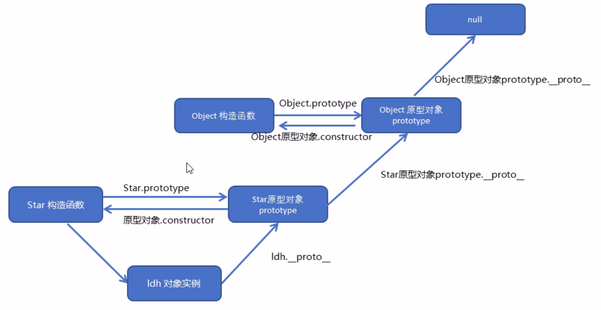

# JS 高级

探索 JS 类、对象、原型链、闭包、严格模式


## 数据类型

**基本类型**

- string
- number
- boolean
- undefined
- null

**引用类型**

- Object：任意对象
- Function：一种特别的对象（可执行）
- Array：一种特别的对象（数值下标，内部有序）

判断数据类型：

1. `typeof`，
   * 可以判断 undefined / 数值 / 字符串 / 布尔值 / function
   * 不能判断 null 与 object，object 与 array
2. `instanceof`，判断对象的具体类型
3. `===`，可以判断 undefined，null

<br>

## 类和对象

1. 简介

与其他面向对象的编程语言类似，`javascript` 有下述规定

* 通过 class 关键字创建类，类名习惯首字母大写
* 类里面有个 constructor 构造函数，可以接受实参传递过来的参数，同时返回对象实例
* constructor 函数只要 new 生成实例就会自动调用，如果不写则默认生成空的 constructor 函数
* 生成实例 new 关键字不能省略
* 最后注意语法规范，创建类不需要加小括号，构造函数不需要加 function

```javascript
class Star{
    constructor(uname,age){
        this.uname = uname;
        this.age = age;
    }
}
var ldh = new Star('刘德华',18);
var zxy = new Star('张学友',18);
```

<br>

2. 共有方法

添加共有方法

```javascript
class Star{
    constructor(uname,age){
        this.uname = uname;
        this.age = age;
    }
    //唱歌
    sing(musicName){
    	console.log(this.name + '唱' + musicName)
    }
}
var zxy = new Star('张学友',18);
zxy.sing('李香兰')
```

<br>

3. 类继承 extends 和 super 关键字

extends：子类可以继承父类的一些属性和方法

super：用于访问和调用父类上的函数，如构造函数或普通函数 

```javascript
class Father{
    constructor(x,y){
        this.x = x;
        this.y = y;
    }
    sum(){
        console.log(this.x + this.y);
        return this.x + this.y;
    }
}
class Son extends Father{
    constructor(x,y){
        super(x,y);//调用父类的构造函数
    }
}
var son = new Son(1,2);
son.sum();
```

* 继承中，如果实例化子类调用某个方法，先看子类中有没有实现这个方法的函数，如果有就先执行子类的，没有就查找父类的有没有
* 继承中，如果子类和父类都有同名的方法，实例化子类调用方法时，则执行子类的，遵循就近原则；如果非要调用父类的方法，则使用 `super.sum()`

注意：**super 必须放到子类的 this 之前**

```javascript
class Son extends Father{
    constructor(x,y){
    	super(x,y);
        this.x = x;
        this.y = y;
    }
    sub(){
        console.log(this.x - this.y);
        return this.x - this.y;
    }
}
```

<br>

4. 类里面的 this 指向

* 类里面的共有属性和方法一定要加 this 使用
* constructor 里面的 this 指向实例对象，方法里面的 this 指向这个方法的调用者

改变 this 指向

```javascript
// 1.通过 that 第二个变量
var that;
class Star {
    constructor(uname,age){
        that = this;//将实例对象赋值给第二个变量
        this.uname = uname;
        this.age = age;
        this.btn = document.getElementById('btn');
        this.btn.onclick = this.sing;
    }
    sing(){
        // 这个 this 指向的是按钮，因为这个按钮调用了这个函数
        console.log(this);
        //undefined
        console.log(this.uname);
        //要使用 uname 用 that
        console.log(that.uname);
    }
}

// 2.es6箭头函数
class Star {
    constructor(uname,age){
        this.uname = uname;
        this.age = age;
        this.btn = document.getElementById('btn');
        this.btn.onclick = this.sing;
    }
    sing = () => {
        console.log(this.uname);
    }
}
```

<br>

5. this 指向补充

可以通过 call，apply，bind 修改函数内部的 this 指向

```javascript
// call
// 第一个作用可以调用函数，第二作用可以改变函数内的 this 指向
// call 主要作用可以实现继承
function Father(name, age, sex){
    this.name = name;
    this.age = age;
    this.sex = sex;
}

function Son(name, age, sex){
    Father.call(this, name, age, sex)
}
var son = new Son('刘德华', 18m '男');
console.log(son);
```

```javascript
// apply
// 作用同 call，唯一不同是传递参数是通过数组
var o = {
    name: '张学友'
};

function fn(arr){
    console.log(this);
    console.log(arr);
}

fn.apply(o, [1,2,3]);

// apply 主要运用:借助 Math 内置对象求数学问题
var arr = [1,55,33,89];
Math.max.apply(Math, arr);
```

```javascript
// bind 不同于 call，apply，它不会调用函数
// 用法同 call，返回由指定 this 值和初始化参数改造的原函数拷贝
var btn = document.querySeletor('button');
btn.onclick = function() {
    this.disabled = true;
    setTimeout(function() {
        this.disabled = false;
    }.bind(this), 3000)
}
```

总结：

相同点

* 都可以改变函数内部 this 指向

区别点

* call 和 apply 会调用函数，并且改变函数内部 this 指向
* call 和 apply 传递的参数不同，call 传递 arg1, arg2,... 的形式，apply 以数组形式 [arg, arg2,...]
* bind 不会调用函数，传递参数同 call

主要应用场景

* call 经常用作继承
* apply 经常跟数组有关
* bind 不调用函数，但是又想改变 this 指向，比如定时器内部的 this 指向


6. Object.defineProperty 重新定义或修改对象属性

```javascript
Object.defineProperty(obj, prop, descriptor);
```

三个参数分别为要修改的对象，对象的属性(字符串)，设置对象 descriptor 描述符。例

```javascript
var obj = {
    name: 'ldh',
    age: 18,
    sing: function(){
        console.log('唱歌')
    }
}
Object.defineProperty(obj, 'name', {
    // 修改后的值
    value: 'zxy',
    // 是否允许修改这个属性，默认 false
    writable: true,
    // 是否允许遍历，默认 false
    enumerable: true,
    // 若为 false,则不允许删除这个属性，不允许再次修改 descriptor 对象，默认 false
    configurable: true
})
```

<br>


## 原型

前面提及类和对象，我们发现每次为类添加属性或者方法，生成实例时，有多少个对象就在堆中开辟多少个空间，每个空间都有同样重复的一些属性或方法，这就造成了内存的浪费。这就要用到原型对象来解决

1. prototype 原型对象

JavaScript 规定，每一个构造函数都有一个 `prototype` 属性，指向另外一个对象。注意这个 `prototype` 就是一个对象，这个对象的所有属性和方法，都会被构造函数所拥有。

我们可以把那些不变的方法，直接定义在 `prototype` 对象上，这样所有实例对象就可以共享这些方法

```javascript
class Star{
    constructor(uname,age){
        this.uname = uname;
        this.age = age;
    }
    sing(){
        console.log('唱歌');
    }
}
var ldh = new Star('刘德华',18);
var zxy = new Star('张学友',18);
ldh.sing();
zxy.sing();

// 改进，删除原先的 sing 方法，使用 prototype 原型对象
Star.prototype.sing = function(){
    console.log('唱歌');
}
```

<br>

2. `__prot__` 对象原型

你可能会疑惑，上述例子实例对象为什么能访问到构造函数的原型对象的方法。

这是因为，对象都会有一个属性 `__proto__` ，指向构造函数的 `prototype` 原型对象

即：实例对象的 `__proto__` 等于它构造函数的 `prototype` 

**对象查找有没有该方法主要是通过 `__proto__` 依次往上查找的**

<br>

3. 原型 constructor 构造函数

原型对象上都有一个 constructor 属性，指向它的构造函数

```javascript
class Star{
    constructor(uname,age){
        this.uname = uname;
        this.age = age;
    }
}
var ldh = new Star('刘德华',18);
Star.prototype.constructor === Star; //true
ldh.__proto__ === Star.prototype
```

如果改变原型对象，要使用 constructor 指回构造函数

```javascript
Star.prototype = {
    constructor: Star,
    sing: function(){
      console.log('唱歌');
    },
    dance: function(){
        console.log('跳舞');
    }
}
```

<br>

4. 构造函数实例和实例对象原型三角关系



<br>

5. 对象成员查找规则

* 当访问一个对象的属性（包括方法）时，首先查找这个对象自身有没有该属性
* 如果没有就查找它的原型（也就是`__proto__` 指向的 prototype 原型对象）
* 如果还没有找到就查找原型对象的原型（通常为 Object 的原型对象）
* 以此类推一直找到原型为 null 为止

<br>

6. 原型链终极图


<br>

## 闭包

前提：变量根据作用域的不同分为两种：全局变量和局部变量

* 函数内部可以使用全局变量
* 函数外部不可以使用局部变量
* 当函数执行完毕，本作用域内的局部变量会被销毁

<br>

> **闭包**指有权访问另一个函数作用域中变量的**函数**。

简单理解就是，一个作用域可以访问另一个作用域内部的局部变量。


闭包的产生，被另一个作用域访问的所在变量的函数称为闭包函数，如下面的 fn 函数

```javascript
function fn() {
	var num = 10;
	function fun() {
		console.log(num);
	}
	return fun;
}
var f = fn();
f();
```

可以看到 fn 外部的作用域可以访问 fn 内部的局部变量，即是说

**闭包的主要作用是：延伸了变量的作用范围**

<br>

经典面试题

问题产生原因：for 是同步的，但是在内部却使用异步方法

1. 循环注册点击事件

```javascript
// 老方法
var lis = document.querySeletor('.nav').querySeletorAll('.li');
for(var i = 0; i< lis.length; i++){
    lis[i].index = i;
    lis[i].onclik = function() {
        // ...
        console.log(this.index);
    }
}

// 闭包方法，创建若干个立即执行函数
for(var i = 0; i< lis.length; i++){
    // 立即执行函数称为小闭包
    (function(i){
        lis[i].onclik = function() {
        	// ...
        	console.log(this.index);
    	}
    })(i);
}
```

2. 循环中的 setTimeout()

```javascript
// 3 秒后打印 li 元素内容
var lis = document.querySeletor('.nav').querySeletorAll('.li');
for(var i = 0; i< lis.length; i++){
    // 创建立即执行函数
    (function(i){
        setTimeout(function(){
            console.log(lis[i].innerHtml);
        }, 3000)
    })(i);
}
```

<br>

拓展思考

```javascript
var name = 'The Window';
var object = {
    name: 'My Object',
    getNameFunc: function(){
        return function(){
            return this.name;
        }
    }
}
console.log(object.getNameFunc()());
//output:The Window，此处 this 指向 window
/* object.getNameFunc()() 相当于
   var f = object.getNameFunc();
   f();
   即
   f = function(){
   	  return this.name;
   }
   f();
   好比立即执行函数，它的 this 就是 window
*/
```

```javascript
var name = 'The Window';
var object = {
    name: 'My Object',
    getNameFunc: function(){
        var that = this;
        return function(){
            return that.name;
        }
    }
}
console.log(object.getNameFunc()());
//output:The Object，产生了闭包
```

<br>

## 严格模式

JavaScript 除了提供正常模式外，还提供了严格模式，即在某种严格的限制下运行 JS 代码。

严格模式在 IE10 以上的版本才会被支持，旧版本会被忽略

严格模式对正常模式的 JavaScript 语义做了一些更改

1. 消除了 JavaScript 语法的一些不合理、不严谨之处，减少了一些怪异行为
2. 消除代码运行的一些不安全之处，保证代码安全运行
3. 提高编译器效率，提升运行速度
4. 禁用了 ECMAScript 的未来版本可能会定义的一些语法和保留字

<br>

**开启严格模式**

严格模式可以应用到整个脚本，也可以运用到单个函数中

```javascript
'use strict';

function fn(){
    'use strict';
}

```

**严格模式下的一些重要变化**

变量

1. 变量名必须先声明再使用
2. 不能随意删除已经定义的变量
3. **严格模式下全局作用域中函数中的 this 是 undefined**
4. 严格模式下，如果构造函数不加 new，this 指向是 undefined 会报错
5. 定时器 this 还是指向 window
6. 事件、对象还是指向调用者

<br>

函数

1. 函数不允许有重名参数
2. 函数必须声明在顶层，不允许在非函数的代码块内声明函数

```javascript
"use strict";
if (true) {
  function f() { } // !!! 语法错误
  f();
}

for (var i = 0; i < 5; i++) {
  function f2() { } // !!! 语法错误
  f2();
}

function baz() { // 合法
  function eit() { } // 同样合法
}
```

<br>