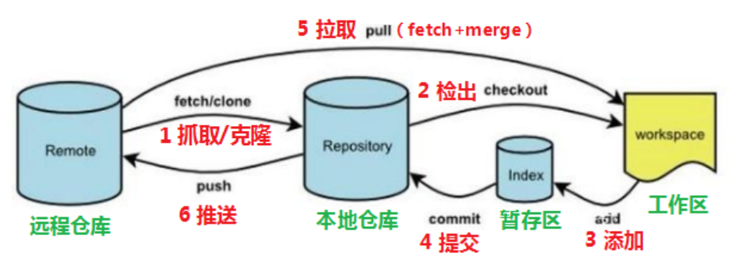
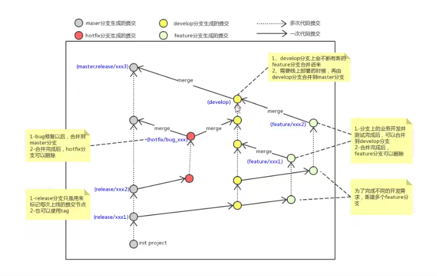

# Git

Git 是目前最流行的版本管理系统，学会 Git 几乎成了开发者的必备技能

<br>

## 下载安装

https://git-scm.com/

下载完毕使用 `git --version` 查看版本

配置初始化

```shell
git config --global user.name "zlfan"
git config --global user.email "xxx@example.com"
```

列出配置信息

```shell
git config --list
```

<br>

## Git 的工作区域和流程

要想弄懂 Git 是怎么对我们的代码进行管理的，那首当其冲的是了解 Git 的工作区域是如何构成的。如下图所示，此图包含了 Git 的 4个工作区和一些常见的操作



命令如下：

* clone（克隆）：从远程仓库中克隆代码到本地仓库
* checkout（检出）：从本地仓库中检出一个仓库分支然后进行修订
* add（添加）：在提交前先将代码提交到暂存区
* commit（提交）：提交到本地仓库。本地仓库中保存修改的各个历史版本
* fetch（抓取）：从远程库，抓取到本地仓库，不进行任何的合并动作，一般操作比较少
* pull（拉取）：从远程库拉到本地库，自动进行合并(merge)，然后放到到工作区，相当于 fetch+merge
* push（推送）： 修改完成后，需要和团队成员共享代码时，将代码推送到远程仓库

```shell
# 一般来说，Git 的工作流程分为以下几步
1.在工作区开发，添加，修改文件。
2.将修改后的文件放入暂存区。
3.将暂存区域的文件提交到本地仓库。
4.将本地仓库的修改推送到远程仓库。
```

<br>

## Git 基本操作

### git add

在工作区添加文件到暂存区

```shell
# 添加指定的文件到暂存区，后面可以跟多个文件名，以空格分隔
git add xxx
# 添加当前更改的所有文件
git add .
```

<br>

### git status

查看的修改的状态（暂存区、工作区），添加到暂存区后使用

```shell
git status
```

<br>

### git commit

提交暂存区的更改到本地仓库

```shell
# 提交暂存的更改，会新开编辑器进行编辑
git commit 
# 提交暂存的更改，并记录下备注（注释）
git commit -m "you message"
# 等同于 git add . && git commit -m
git commit -am
# 对最近一次的提交的信息进行修改,此操作会修改 commit 的 hash 值
git commit --amend
```

<br>

### git log

查看提交记录，主要找到提交的 commitId

```shell
# 命令形式
git log [option]
```

* option
  * --all 显示所有分支
  * --pretty=oneline 将提交信息显示为一行
  * --abbrev-commit 使得输出的commitId更简短
  * --graph 以图的形式显示

<br>

### git reset

根据查找到的 commitId 版本回退 / 切换

```shell
git reset --hard commitId
```

如何查看已经删除的记录，找到 commitId 

```shell
git reflog
```

<br>

### 添加文件至忽略列表

一般我们总会有些文件无需纳入Git 的管理，也不希望它们总出现在未跟踪文件列表。例如一些日志或者临时文件，我们可以在工作目录中创建一个名为 .gitignore 的文件（文件名称固定），列出要忽略的文件模式。这些文件在本地存在，但并不会 push 到 远程主机

```shell
# 过滤整个文件夹
/mtk/
# 过滤所有.zip文件
*.zip
# 过滤某个具体文件
/mtk/do.c
```

配置语法

* 以斜杠 `/` 开头表示目录
* 以星号 `*` 通配多个字符
* 以问号 `?` 通配单个字符
* 以方括号 `[]` 包含单个字符的匹配列表
* 以叹号 `!` 表示不忽略（跟踪）匹配到的文件或目录

<br>

## Git 分支

几乎所有的版本控制系统都以某种形式支持分支。 使用分支意味着你可以把你的工作从开发主线上分离 开来进行重大的Bug修改、开发新的功能，以免影响开发主线

### 基本使用

1. 查看本地分支

```shell
git branch
```

2. 创建本地分支

```shell
git branch 分支名
```

3. **切换分支**

```shell
git checkout 分支名
```

```shell
# 直接切换到一个不存在的分支，即创建并切换
git checkout -b 分支名
```

4. **合并分支**

```shell
# 一个分支上的提交可以合并到另一个分支
# 注意要先切换到主分支
git merge 分支名称
```

5. 删除分支

```shell
# 删除分支时，需要做各种检查再删除
git branch -d b1
```

<br>

### 解决冲突

当两个分支上对文件的修改可能会存在冲突，例如同时修改了同一个文件的同一行再进行合并时，这时就需要手动解决冲突，解决冲突步骤如下

1. 根据 `git merge` 提示找到文件中冲突的地方
2. 将解决完冲突的文件加入暂存区，`git add .`
3. 再次提交到仓库，`git commit -m '注释'`

冲突的文件内容通常表现为以下形式

```shell
<<<<<<< HEAD
count = 0
=======
count = 1
>>>>>>> dev
```

HEAD 到 = 之间为当前分支的内容，= 到 dev 之间为 dev 的内容

解决办法就是删掉 git 自动为我们添加的提示，手动修改为

```shell
count = 2
```

然后添加到暂存区，再提交

```shell
git add .
git commit -m 'Resolving Conflicts'
```

<br>

### 分支名规范

使用分支意味着你可以把你的工作从开发主线上分离 开来进行重大的 Bug 修改、开发新的功能，以免影响开发主线

在开发中，一般有如下分支使用原则与流程：

* master / main（生产） 分支

  线上分支，主分支，中小规模项目作为线上运行的应用对应的分支

* develop（开发）分支

  是从 master 创建的分支，一般作为开发部门的主要开发分支，如果没有其他并行开发不同期上线 要求，都可以在此版本进行开发，阶段开发完成后，需要是合并到 master 分支,准备上线

* feature / xxxx 分支

  从develop创建的分支，一般是同期并行开发，但不同期上线时创建的分支，分支上的研发任务完 成后合并到 develop 分支

* hotfix / xxxx 分支

  从 master 派生的分支，一般作为线上 bug 修复使用，修复完成后需要合并到 master、test、 develop 分支

* 还有一些其他分支，在此不再详述，例如 test 分支（用于代码测试）、pre 分支（预上线分支）等等



<br>

## 远程仓库管理

我们之前的所有操作都是在本地进行的，需要将代码托管到服务器上，其中比较常见的有 github，码云等

:exclamation: 本节内容默认已与 github 配置好 ssh 密钥钥

### 操作远程仓库

1. 添加远程仓库
   * 远端名称，默认是 origin，取决于远端服务器设置
   * 仓库路径，从远端服务器获取此 URL

```shell
 git remote add <远端名称> <仓库路径>
```

2. 查看远程仓库

```shell
git remote
```

3. 推送到远程仓库

   * 如果远程分支名和本地分支名称相同，则可以只写本地分支

     git push origin master

   * -f 表示强制覆盖，不推荐

   * `--set-upstream` 推送到远端的同时并且建立起和远端分支的关联关系，作用同 `-u` 参数

   * 如果当前分支已经和远端分支关联，则可以省略分支名和远端名

     git push

```shell
git push [-f] [--set-upstream] [远端名称 [本地分支名][:远端分支名] ]
```

4. 本地分支与远程分支的关联关系，蓝色字为远程仓库分支

```shell
git branch -vv
```

5. 从远程仓库克隆

```shell
git clone 地址
```

6. 从远程仓库中抓取和拉取

```shell
# 获取远程仓库特定分支的更新
git fetch <远程主机名> <分支名>
# 获取远程仓库所有分支的更新
git fetch --all
```

```shell
# 从远程仓库拉取代码并合并到本地，可简写为 git pull
# 等同于 git fetch && git merge 
git pull <远程主机名> <远程分支名>:<本地分支名>
```

与 `git pull` 不同的是 `git fetch` 操作仅仅只会拉取远程的更改，不会自动进行 merge 操作。对你当前的代码没有影响

总结，在 pull 之前先进行 fetch，看看是否有更新，确定没有更新再 pull